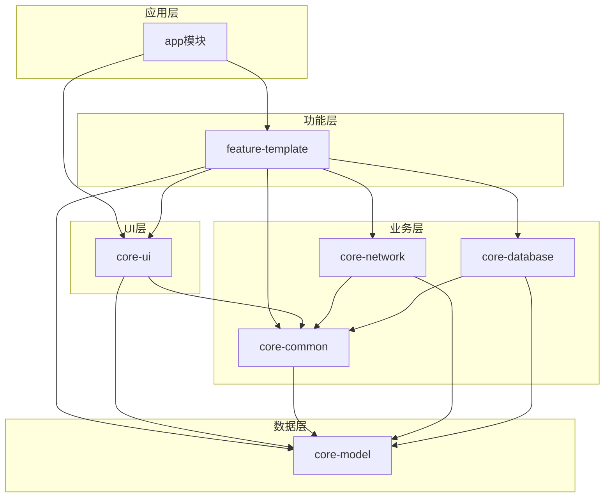
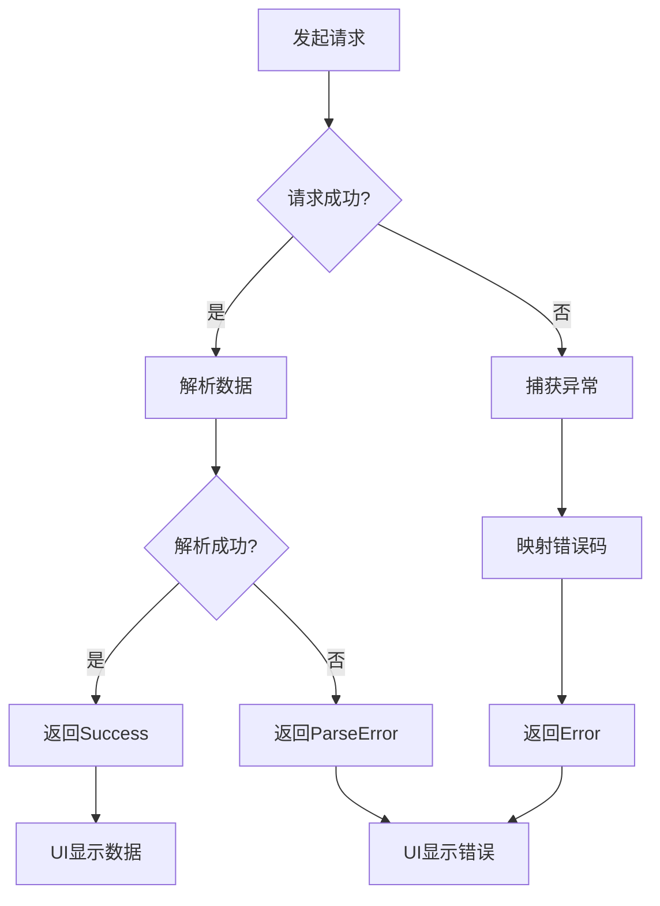

# Android通用框架设计文档

## 概述

本文档描述Android通用框架的技术架构设计，采用MVVM + Clean Architecture模式，提供模块化、可扩展、高性能的企业级开发框架。

### 设计目标

1. **模块化**：清晰的模块边界，低耦合高内聚
2. **可扩展**：易于添加新功能模块
3. **高性能**：优化编译速度和运行性能
4. **易维护**：统一的代码规范和架构模式
5. **生产就绪**：完善的错误处理和日志系统

## 架构设计

### 整体架构



### 模块职责

| 模块 | 职责 | 依赖 |
|------|------|------|
| **app** | 应用入口、全局配置、模块集成 | 所有模块 |
| **feature-template** | 功能示例、业务逻辑实现 | core-ui, core-common, core-network, core-database, core-model |
| **core-ui** | UI基类、通用组件、自定义控件 | core-common, core-model |
| **core-common** | 基础架构、工具类、扩展函数 | core-model |
| **core-network** | 网络请求、拦截器、错误处理 | core-common, core-model |
| **core-database** | 数据库访问、实体定义、DAO | core-common, core-model |
| **core-model** | 数据模型、错误码、状态定义 | 无 |

### 依赖规则

1. **单向依赖**：上层模块可依赖下层模块，反之不可
2. **禁止循环依赖**：任何两个模块之间不能形成循环依赖
3. **feature模块隔离**：feature模块之间禁止相互依赖
4. **core模块稳定**：core模块应保持API稳定，避免频繁变更

## 技术栈选型

### 核心技术

| 技术 | 版本 | 选型理由 |
|------|------|---------|
| **Kotlin** | 2.0.21 | 官方推荐、空安全、协程支持 |
| **AGP** | 8.10.1 | 最新稳定版、性能优化 |
| **Gradle** | 8.10.2 | 构建性能、Version Catalog支持 |

### 架构组件

| 组件 | 版本 | 选型理由 |
|------|------|---------|
| **Hilt** | 2.51 | 官方DI框架、编译时检查、易用 |
| **Lifecycle** | 2.8.7 | 生命周期感知、内存安全 |
| **ViewModel** | 2.8.7 | 状态管理、配置变更保持 |
| **Coroutines** | 1.9.0 | 异步编程、结构化并发 |
| **Flow** | 1.9.0 | 响应式数据流、替代LiveData |

### 网络层

| 组件 | 版本 | 选型理由 |
|------|------|---------|
| **Retrofit** | 2.11.0 | 类型安全、协程支持、易用 |
| **OkHttp** | 4.12.0 | 高性能、拦截器机制 |
| **Gson** | 2.11.0 | JSON解析、性能稳定 |

### 数据库层

| 组件 | 版本 | 选型理由 |
|------|------|---------|
| **Room** | 2.6.1 | 官方ORM、编译时检查、Flow支持 |
| **KSP** | 2.0.21-1.0.28 | 替代KAPT、编译速度快 |

### UI组件

| 组件 | 版本 | 选型理由 |
|------|------|---------|
| **ViewBinding** | - | 类型安全、空安全、性能好 |
| **Material** | 1.13.0 | Material Design规范 |
| **ConstraintLayout** | 2.2.1 | 灵活布局、性能优化 |

## 组件和接口设计

### 1. core-model模块

#### ApiResponse - API响应包装

```kotlin
/**
 * 统一API响应包装类
 * @param T 数据类型
 */
data class ApiResponse<T>(
    val code: Int,           // 响应码
    val message: String,     // 响应消息
    val data: T?            // 响应数据
) {
    fun isSuccess(): Boolean = code == 200
}
```

#### Result - 业务结果封装

```kotlin
/**
 * 业务结果封装类
 * @param T 成功数据类型
 */
sealed class Result<out T> {
    data class Success<T>(val data: T) : Result<T>()
    data class Error(val code: Int, val message: String, val exception: Throwable? = null) : Result<Nothing>()
    
    fun isSuccess(): Boolean = this is Success
    fun isError(): Boolean = this is Error
}
```


#### UiState - UI状态密封类

```kotlin
/**
 * UI状态密封类
 * @param T 数据类型
 */
sealed class UiState<out T> {
    object Idle : UiState<Nothing>()
    object Loading : UiState<Nothing>()
    data class Success<T>(val data: T) : UiState<T>()
    data class Error(val code: Int, val message: String) : UiState<Nothing>()
}
```

#### PageData - 分页数据模型

```kotlin
/**
 * 分页数据模型
 * @param T 列表项类型
 */
data class PageData<T>(
    val list: List<T>,       // 数据列表
    val pageNum: Int,        // 当前页码
    val pageSize: Int,       // 每页大小
    val total: Int,          // 总数量
    val hasMore: Boolean     // 是否有更多
)
```

#### ErrorCode - 错误码枚举

```kotlin
/**
 * 错误码枚举
 */
enum class ErrorCode(val code: Int, val message: String) {
    // 网络错误
    NETWORK_ERROR(-1, "网络连接失败"),
    TIMEOUT_ERROR(-2, "请求超时"),
    
    // HTTP错误
    BAD_REQUEST(400, "请求参数错误"),
    UNAUTHORIZED(401, "未授权，请登录"),
    FORBIDDEN(403, "禁止访问"),
    NOT_FOUND(404, "资源不存在"),
    SERVER_ERROR(500, "服务器错误"),
    
    // 业务错误
    UNKNOWN_ERROR(-999, "未知错误"),
    PARSE_ERROR(-998, "数据解析失败");
    
    companion object {
        fun fromCode(code: Int): ErrorCode {
            return values().find { it.code == code } ?: UNKNOWN_ERROR
        }
    }
}
```

### 2. core-network模块

#### RetrofitClient - Retrofit客户端

```kotlin
/**
 * Retrofit客户端单例
 */
object RetrofitClient {
    private const val DEFAULT_TIMEOUT = 15L
    private const val READ_TIMEOUT = 30L
    private const val WRITE_TIMEOUT = 30L
    
    private var baseUrl: String = ""
    
    private val okHttpClient: OkHttpClient by lazy {
        OkHttpClient.Builder()
            .connectTimeout(DEFAULT_TIMEOUT, TimeUnit.SECONDS)
            .readTimeout(READ_TIMEOUT, TimeUnit.SECONDS)
            .writeTimeout(WRITE_TIMEOUT, TimeUnit.SECONDS)
            .addInterceptor(LoggingInterceptor())
            .addInterceptor(TokenInterceptor())
            .addInterceptor(SignInterceptor())
            .build()
    }
    
    private val retrofit: Retrofit by lazy {
        Retrofit.Builder()
            .baseUrl(baseUrl)
            .client(okHttpClient)
            .addConverterFactory(GsonConverterFactory.create())
            .build()
    }
    
    fun setBaseUrl(url: String) {
        baseUrl = url
    }
    
    fun <T> create(service: Class<T>): T {
        return retrofit.create(service)
    }
}
```

#### 拦截器设计

**LoggingInterceptor - 日志拦截器**

```kotlin
/**
 * 日志拦截器
 * Debug模式下输出完整请求和响应日志
 */
class LoggingInterceptor : Interceptor {
    override fun intercept(chain: Interceptor.Chain): Response {
        val request = chain.request()
        
        if (BuildConfig.DEBUG) {
            LogUtil.d("Request: ${request.method} ${request.url}")
            LogUtil.d("Headers: ${request.headers}")
            request.body?.let {
                LogUtil.d("Body: ${it.contentLength()} bytes")
            }
        }
        
        val response = chain.proceed(request)
        
        if (BuildConfig.DEBUG) {
            LogUtil.d("Response: ${response.code} ${response.message}")
        }
        
        return response
    }
}
```

**TokenInterceptor - Token拦截器**

```kotlin
/**
 * Token拦截器
 * 自动在请求头添加Authorization
 */
class TokenInterceptor : Interceptor {
    override fun intercept(chain: Interceptor.Chain): Response {
        val token = SPUtil.getString("token", "")
        val request = if (token.isNotEmpty()) {
            chain.request().newBuilder()
                .addHeader("Authorization", "Bearer $token")
                .build()
        } else {
            chain.request()
        }
        return chain.proceed(request)
    }
}
```

**SignInterceptor - 签名拦截器**

```kotlin
/**
 * 签名拦截器
 * 为请求添加签名参数
 */
class SignInterceptor : Interceptor {
    override fun intercept(chain: Interceptor.Chain): Response {
        val original = chain.request()
        val timestamp = System.currentTimeMillis()
        val sign = generateSign(timestamp)
        
        val url = original.url.newBuilder()
            .addQueryParameter("timestamp", timestamp.toString())
            .addQueryParameter("sign", sign)
            .build()
        
        val request = original.newBuilder()
            .url(url)
            .build()
        
        return chain.proceed(request)
    }
    
    private fun generateSign(timestamp: Long): String {
        // 签名算法实现
        return ""
    }
}
```

#### Flow扩展函数

```kotlin
/**
 * 统一网络请求包装
 * 自动处理异常并转换为Result类型
 */
suspend fun <T> flowRequest(
    block: suspend () -> ApiResponse<T>
): Flow<Result<T>> = flow {
    try {
        val response = block()
        if (response.isSuccess()) {
            emit(Result.Success(response.data!!))
        } else {
            emit(Result.Error(response.code, response.message))
        }
    } catch (e: Exception) {
        emit(handleException(e))
    }
}.flowOn(Dispatchers.IO)

/**
 * 异常处理
 */
private fun <T> handleException(e: Exception): Result.Error {
    return when (e) {
        is UnknownHostException -> Result.Error(
            ErrorCode.NETWORK_ERROR.code,
            ErrorCode.NETWORK_ERROR.message,
            e
        )
        is SocketTimeoutException -> Result.Error(
            ErrorCode.TIMEOUT_ERROR.code,
            ErrorCode.TIMEOUT_ERROR.message,
            e
        )
        else -> Result.Error(
            ErrorCode.UNKNOWN_ERROR.code,
            e.message ?: ErrorCode.UNKNOWN_ERROR.message,
            e
        )
    }
}
```

#### NetworkModule - Hilt模块

```kotlin
/**
 * 网络层Hilt模块
 */
@Module
@InstallIn(SingletonComponent::class)
object NetworkModule {
    
    @Provides
    @Singleton
    fun provideOkHttpClient(): OkHttpClient {
        return OkHttpClient.Builder()
            .connectTimeout(15, TimeUnit.SECONDS)
            .readTimeout(30, TimeUnit.SECONDS)
            .writeTimeout(30, TimeUnit.SECONDS)
            .addInterceptor(LoggingInterceptor())
            .addInterceptor(TokenInterceptor())
            .build()
    }
    
    @Provides
    @Singleton
    fun provideRetrofit(okHttpClient: OkHttpClient): Retrofit {
        return Retrofit.Builder()
            .baseUrl("https://api.example.com/")
            .client(okHttpClient)
            .addConverterFactory(GsonConverterFactory.create())
            .build()
    }
}
```


### 3. core-database模块

#### AppDatabase - 数据库配置

```kotlin
/**
 * 应用数据库
 */
@Database(
    entities = [UserEntity::class],
    version = 1,
    exportSchema = false
)
abstract class AppDatabase : RoomDatabase() {
    abstract fun userDao(): UserDao
    
    companion object {
        const val DATABASE_NAME = "atlas_db"
    }
}
```

#### BaseDao - 通用DAO接口

```kotlin
/**
 * 通用DAO接口
 * 提供基础CRUD操作
 */
interface BaseDao<T> {
    @Insert(onConflict = OnConflictStrategy.REPLACE)
    suspend fun insert(entity: T): Long
    
    @Insert(onConflict = OnConflictStrategy.REPLACE)
    suspend fun insertAll(entities: List<T>): List<Long>
    
    @Update
    suspend fun update(entity: T): Int
    
    @Delete
    suspend fun delete(entity: T): Int
}
```

#### UserEntity - 用户实体示例

```kotlin
/**
 * 用户实体
 */
@Entity(tableName = "user")
data class UserEntity(
    @PrimaryKey
    @ColumnInfo(name = "id")
    val id: Long,
    
    @ColumnInfo(name = "username")
    val username: String,
    
    @ColumnInfo(name = "avatar")
    val avatar: String?,
    
    @ColumnInfo(name = "create_time")
    val createTime: Long
)
```

#### UserDao - 用户DAO

```kotlin
/**
 * 用户DAO
 */
@Dao
interface UserDao : BaseDao<UserEntity> {
    
    @Query("SELECT * FROM user WHERE id = :id")
    fun getUserById(id: Long): Flow<UserEntity?>
    
    @Query("SELECT * FROM user")
    fun getAllUsers(): Flow<List<UserEntity>>
    
    @Query("DELETE FROM user WHERE id = :id")
    suspend fun deleteById(id: Long): Int
    
    @Query("DELETE FROM user")
    suspend fun deleteAll(): Int
}
```

#### DatabaseModule - Hilt模块

```kotlin
/**
 * 数据库Hilt模块
 */
@Module
@InstallIn(SingletonComponent::class)
object DatabaseModule {
    
    @Provides
    @Singleton
    fun provideAppDatabase(
        @ApplicationContext context: Context
    ): AppDatabase {
        return Room.databaseBuilder(
            context,
            AppDatabase::class.java,
            AppDatabase.DATABASE_NAME
        )
            .fallbackToDestructiveMigration()
            .build()
    }
    
    @Provides
    @Singleton
    fun provideUserDao(database: AppDatabase): UserDao {
        return database.userDao()
    }
}
```

### 4. core-common模块

#### BaseViewModel - ViewModel基类

```kotlin
/**
 * ViewModel基类
 * 提供统一的状态管理
 */
abstract class BaseViewModel : ViewModel() {
    
    // Loading状态
    private val _loading = MutableStateFlow(false)
    val loading: StateFlow<Boolean> = _loading.asStateFlow()
    
    // 错误信息
    private val _error = MutableSharedFlow<String>()
    val error: SharedFlow<String> = _error.asSharedFlow()
    
    /**
     * 显示Loading
     */
    protected fun showLoading() {
        _loading.value = true
    }
    
    /**
     * 隐藏Loading
     */
    protected fun hideLoading() {
        _loading.value = false
    }
    
    /**
     * 显示错误
     */
    protected fun showError(message: String) {
        viewModelScope.launch {
            _error.emit(message)
        }
    }
    
    /**
     * 启动协程
     */
    protected fun launchIO(block: suspend CoroutineScope.() -> Unit) {
        viewModelScope.launch(Dispatchers.IO) {
            block()
        }
    }
}
```

#### BaseRepository - Repository基类

```kotlin
/**
 * Repository基类
 * 提供统一的数据访问模式
 */
abstract class BaseRepository {
    
    /**
     * 执行网络请求
     */
    protected suspend fun <T> executeRequest(
        block: suspend () -> ApiResponse<T>
    ): Result<T> {
        return try {
            val response = block()
            if (response.isSuccess()) {
                Result.Success(response.data!!)
            } else {
                Result.Error(response.code, response.message)
            }
        } catch (e: Exception) {
            ErrorMapper.mapException(e)
        }
    }
    
    /**
     * 执行数据库操作
     */
    protected suspend fun <T> executeDb(
        block: suspend () -> T
    ): Result<T> {
        return try {
            val data = block()
            Result.Success(data)
        } catch (e: Exception) {
            Result.Error(
                ErrorCode.UNKNOWN_ERROR.code,
                e.message ?: "数据库操作失败"
            )
        }
    }
}
```

#### DispatcherProvider - 协程调度器

```kotlin
/**
 * 协程调度器提供者
 * 便于测试时Mock
 */
interface DispatcherProvider {
    val main: CoroutineDispatcher
    val io: CoroutineDispatcher
    val default: CoroutineDispatcher
}

class DefaultDispatcherProvider : DispatcherProvider {
    override val main: CoroutineDispatcher = Dispatchers.Main
    override val io: CoroutineDispatcher = Dispatchers.IO
    override val default: CoroutineDispatcher = Dispatchers.Default
}
```

#### ExceptionHandler - 异常处理器

```kotlin
/**
 * 全局异常处理器
 */
object ExceptionHandler {
    
    fun handle(throwable: Throwable): String {
        return when (throwable) {
            is UnknownHostException -> "网络连接失败"
            is SocketTimeoutException -> "请求超时"
            is HttpException -> handleHttpException(throwable)
            is JsonSyntaxException -> "数据解析失败"
            else -> throwable.message ?: "未知错误"
        }
    }
    
    private fun handleHttpException(exception: HttpException): String {
        return when (exception.code()) {
            400 -> "请求参数错误"
            401 -> "未授权，请登录"
            403 -> "禁止访问"
            404 -> "资源不存在"
            500 -> "服务器错误"
            else -> "网络错误: ${exception.code()}"
        }
    }
}
```

#### ErrorMapper - 错误映射器

```kotlin
/**
 * 错误映射器
 * 将异常转换为Result.Error
 */
object ErrorMapper {
    
    fun mapException(exception: Exception): Result.Error {
        val errorCode = when (exception) {
            is UnknownHostException -> ErrorCode.NETWORK_ERROR
            is SocketTimeoutException -> ErrorCode.TIMEOUT_ERROR
            is JsonSyntaxException -> ErrorCode.PARSE_ERROR
            else -> ErrorCode.UNKNOWN_ERROR
        }
        
        return Result.Error(
            errorCode.code,
            errorCode.message,
            exception
        )
    }
}
```


#### 工具类设计

**LogUtil - 日志工具**

```kotlin
/**
 * 日志工具
 * 支持Debug/Release环境切换
 */
object LogUtil {
    private const val TAG = "Atlas"
    private var isDebug = BuildConfig.DEBUG
    
    fun d(message: String, tag: String = TAG) {
        if (isDebug) {
            Log.d(tag, message)
        }
    }
    
    fun e(message: String, throwable: Throwable? = null, tag: String = TAG) {
        if (isDebug) {
            Log.e(tag, message, throwable)
        }
    }
}
```

**SPUtil - SharedPreferences工具**

```kotlin
/**
 * SharedPreferences工具
 * 提供类型安全的存取方法
 */
object SPUtil {
    private const val NAME = "atlas_sp"
    private lateinit var sp: SharedPreferences
    
    fun init(context: Context) {
        sp = context.getSharedPreferences(NAME, Context.MODE_PRIVATE)
    }
    
    fun putString(key: String, value: String) {
        sp.edit().putString(key, value).apply()
    }
    
    fun getString(key: String, default: String = ""): String {
        return sp.getString(key, default) ?: default
    }
    
    fun putInt(key: String, value: Int) {
        sp.edit().putInt(key, value).apply()
    }
    
    fun getInt(key: String, default: Int = 0): Int {
        return sp.getInt(key, default)
    }
    
    fun putBoolean(key: String, value: Boolean) {
        sp.edit().putBoolean(key, value).apply()
    }
    
    fun getBoolean(key: String, default: Boolean = false): Boolean {
        return sp.getBoolean(key, default)
    }
    
    fun remove(key: String) {
        sp.edit().remove(key).apply()
    }
    
    fun clear() {
        sp.edit().clear().apply()
    }
}
```

**ToastUtil - Toast工具**

```kotlin
/**
 * Toast工具
 * 避免重复显示
 */
object ToastUtil {
    private var toast: Toast? = null
    
    fun show(context: Context, message: String, duration: Int = Toast.LENGTH_SHORT) {
        toast?.cancel()
        toast = Toast.makeText(context, message, duration)
        toast?.show()
    }
}
```

#### Kotlin扩展函数

**StringExt - 字符串扩展**

```kotlin
/**
 * 判断字符串是否为空或空白
 */
fun String?.isNullOrBlank(): Boolean {
    return this == null || this.isBlank()
}

/**
 * 判断字符串是否不为空
 */
fun String?.isNotNullOrBlank(): Boolean {
    return !this.isNullOrBlank()
}

/**
 * 安全转换为Int
 */
fun String?.toIntOrDefault(default: Int = 0): Int {
    return this?.toIntOrNull() ?: default
}
```

**ContextExt - Context扩展**

```kotlin
/**
 * 显示Toast
 */
fun Context.toast(message: String, duration: Int = Toast.LENGTH_SHORT) {
    ToastUtil.show(this, message, duration)
}

/**
 * dp转px
 */
fun Context.dp2px(dp: Float): Int {
    return (dp * resources.displayMetrics.density + 0.5f).toInt()
}

/**
 * px转dp
 */
fun Context.px2dp(px: Float): Int {
    return (px / resources.displayMetrics.density + 0.5f).toInt()
}
```

**ViewExt - View扩展**

```kotlin
/**
 * 显示View
 */
fun View.visible() {
    visibility = View.VISIBLE
}

/**
 * 隐藏View
 */
fun View.gone() {
    visibility = View.GONE
}

/**
 * 不可见View
 */
fun View.invisible() {
    visibility = View.INVISIBLE
}

/**
 * 防抖点击
 */
fun View.setOnClickListener(interval: Long = 500, onClick: (View) -> Unit) {
    var lastClickTime = 0L
    setOnClickListener {
        val currentTime = System.currentTimeMillis()
        if (currentTime - lastClickTime > interval) {
            lastClickTime = currentTime
            onClick(it)
        }
    }
}
```

**FlowExt - Flow扩展**

```kotlin
/**
 * 在主线程收集Flow
 */
fun <T> Flow<T>.collectOnMain(
    lifecycleOwner: LifecycleOwner,
    action: suspend (T) -> Unit
) {
    lifecycleOwner.lifecycleScope.launch {
        lifecycleOwner.repeatOnLifecycle(Lifecycle.State.STARTED) {
            collect { action(it) }
        }
    }
}

/**
 * 处理Result类型的Flow
 */
fun <T> Flow<Result<T>>.onResult(
    onSuccess: (T) -> Unit,
    onError: (Int, String) -> Unit
): Flow<Result<T>> {
    return this.onEach { result ->
        when (result) {
            is Result.Success -> onSuccess(result.data)
            is Result.Error -> onError(result.code, result.message)
        }
    }
}
```

### 5. core-ui模块

#### BaseActivity - Activity基类

```kotlin
/**
 * Activity基类
 */
abstract class BaseActivity : AppCompatActivity() {
    
    protected abstract fun getLayoutId(): Int
    
    override fun onCreate(savedInstanceState: Bundle?) {
        super.onCreate(savedInstanceState)
        setContentView(getLayoutId())
        initView()
        initData()
    }
    
    protected open fun initView() {}
    
    protected open fun initData() {}
    
    protected fun showToast(message: String) {
        toast(message)
    }
}
```

#### BaseVMActivity - 带ViewModel的Activity

```kotlin
/**
 * 带ViewModel的Activity基类
 */
@AndroidEntryPoint
abstract class BaseVMActivity<VB : ViewBinding, VM : BaseViewModel> : AppCompatActivity() {
    
    protected lateinit var binding: VB
    protected abstract val viewModel: VM
    
    override fun onCreate(savedInstanceState: Bundle?) {
        super.onCreate(savedInstanceState)
        binding = createBinding()
        setContentView(binding.root)
        
        initView()
        observeData()
        initData()
    }
    
    protected abstract fun createBinding(): VB
    
    protected open fun initView() {}
    
    protected open fun observeData() {
        // 观察Loading状态
        viewModel.loading.collectOnMain(this) { isLoading ->
            if (isLoading) showLoading() else hideLoading()
        }
        
        // 观察错误信息
        viewModel.error.collectOnMain(this) { message ->
            showError(message)
        }
    }
    
    protected open fun initData() {}
    
    protected open fun showLoading() {}
    
    protected open fun hideLoading() {}
    
    protected open fun showError(message: String) {
        toast(message)
    }
}
```

#### StateLayout - 状态布局

```kotlin
/**
 * 状态布局容器
 * 支持Loading、Success、Error、Empty状态切换
 */
class StateLayout @JvmOverloads constructor(
    context: Context,
    attrs: AttributeSet? = null,
    defStyleAttr: Int = 0
) : FrameLayout(context, attrs, defStyleAttr) {
    
    private var loadingView: View? = null
    private var errorView: View? = null
    private var emptyView: View? = null
    private var contentView: View? = null
    
    fun showLoading() {
        showView(loadingView)
    }
    
    fun showSuccess() {
        showView(contentView)
    }
    
    fun showError(message: String, onRetry: () -> Unit) {
        errorView?.let {
            it.findViewById<TextView>(R.id.tv_error_message)?.text = message
            it.findViewById<View>(R.id.btn_retry)?.setOnClickListener { onRetry() }
        }
        showView(errorView)
    }
    
    fun showEmpty(message: String) {
        emptyView?.let {
            it.findViewById<TextView>(R.id.tv_empty_message)?.text = message
        }
        showView(emptyView)
    }
    
    private fun showView(view: View?) {
        for (i in 0 until childCount) {
            getChildAt(i).gone()
        }
        view?.visible()
    }
}
```


#### BaseAdapter - RecyclerView适配器

```kotlin
/**
 * RecyclerView通用适配器
 */
abstract class BaseAdapter<T, VH : BaseViewHolder<T>>(
    private val diffCallback: DiffUtil.ItemCallback<T>
) : ListAdapter<T, VH>(diffCallback) {
    
    override fun onBindViewHolder(holder: VH, position: Int) {
        holder.bind(getItem(position))
    }
    
    protected fun getItemAt(position: Int): T {
        return getItem(position)
    }
}

/**
 * ViewHolder基类
 */
abstract class BaseViewHolder<T>(itemView: View) : RecyclerView.ViewHolder(itemView) {
    abstract fun bind(item: T)
}
```

#### ViewBinding扩展

```kotlin
/**
 * Activity ViewBinding扩展
 */
inline fun <reified VB : ViewBinding> AppCompatActivity.viewBinding(): Lazy<VB> {
    return lazy(LazyThreadSafetyMode.NONE) {
        val inflateMethod = VB::class.java.getMethod(
            "inflate",
            LayoutInflater::class.java
        )
        @Suppress("UNCHECKED_CAST")
        inflateMethod.invoke(null, layoutInflater) as VB
    }
}

/**
 * Fragment ViewBinding扩展
 */
inline fun <reified VB : ViewBinding> Fragment.viewBinding(): Lazy<VB> {
    return lazy(LazyThreadSafetyMode.NONE) {
        val inflateMethod = VB::class.java.getMethod(
            "inflate",
            LayoutInflater::class.java,
            ViewGroup::class.java,
            Boolean::class.java
        )
        @Suppress("UNCHECKED_CAST")
        inflateMethod.invoke(null, layoutInflater, null, false) as VB
    }
}
```

### 6. feature-template模块

#### MVVM架构实现

**LoginViewModel**

```kotlin
/**
 * 登录ViewModel
 */
@HiltViewModel
class LoginViewModel @Inject constructor(
    private val repository: LoginRepository
) : BaseViewModel() {
    
    private val _loginState = MutableStateFlow<UiState<User>>(UiState.Idle)
    val loginState: StateFlow<UiState<User>> = _loginState.asStateFlow()
    
    fun login(username: String, password: String) {
        if (!validateInput(username, password)) {
            return
        }
        
        viewModelScope.launch {
            _loginState.value = UiState.Loading
            
            when (val result = repository.login(username, password)) {
                is Result.Success -> {
                    _loginState.value = UiState.Success(result.data)
                }
                is Result.Error -> {
                    _loginState.value = UiState.Error(result.code, result.message)
                }
            }
        }
    }
    
    private fun validateInput(username: String, password: String): Boolean {
        if (username.isBlank()) {
            showError("请输入用户名")
            return false
        }
        if (password.isBlank()) {
            showError("请输入密码")
            return false
        }
        if (password.length < 6) {
            showError("密码长度不能少于6位")
            return false
        }
        return true
    }
}
```

**LoginRepository**

```kotlin
/**
 * 登录Repository
 */
class LoginRepository @Inject constructor(
    private val api: LoginApi,
    private val userDao: UserDao
) : BaseRepository() {
    
    suspend fun login(username: String, password: String): Result<User> {
        // 网络请求
        val result = executeRequest {
            api.login(LoginRequest(username, password))
        }
        
        // 保存到本地数据库
        if (result is Result.Success) {
            val user = result.data
            userDao.insert(user.toEntity())
            SPUtil.putString("token", user.token)
        }
        
        return result
    }
}
```

**LoginActivity**

```kotlin
/**
 * 登录Activity
 */
@AndroidEntryPoint
class LoginActivity : BaseVMActivity<ActivityLoginBinding, LoginViewModel>() {
    
    override val viewModel: LoginViewModel by viewModels()
    
    override fun createBinding(): ActivityLoginBinding {
        return ActivityLoginBinding.inflate(layoutInflater)
    }
    
    override fun initView() {
        binding.btnLogin.setOnClickListener {
            val username = binding.etUsername.text.toString()
            val password = binding.etPassword.text.toString()
            viewModel.login(username, password)
        }
    }
    
    override fun observeData() {
        super.observeData()
        
        viewModel.loginState.collectOnMain(this) { state ->
            when (state) {
                is UiState.Loading -> {
                    binding.btnLogin.isEnabled = false
                }
                is UiState.Success -> {
                    binding.btnLogin.isEnabled = true
                    toast("登录成功")
                    // 跳转到主页
                    finish()
                }
                is UiState.Error -> {
                    binding.btnLogin.isEnabled = true
                    toast(state.message)
                }
                else -> {}
            }
        }
    }
}
```

## 数据模型

### 用户模型

```kotlin
/**
 * 用户数据模型
 */
data class User(
    val id: Long,
    val username: String,
    val avatar: String?,
    val token: String
) {
    fun toEntity(): UserEntity {
        return UserEntity(
            id = id,
            username = username,
            avatar = avatar,
            createTime = System.currentTimeMillis()
        )
    }
}
```

### 登录请求/响应模型

```kotlin
/**
 * 登录请求
 */
data class LoginRequest(
    val username: String,
    val password: String
)

/**
 * 登录响应
 */
data class LoginResponse(
    val user: User
)
```

## 错误处理策略

### 错误处理流程



### 错误处理层级

1. **网络层**：捕获网络异常（超时、连接失败等）
2. **数据层**：捕获解析异常（JSON解析失败等）
3. **业务层**：处理业务错误（登录失败、权限不足等）
4. **UI层**：展示用户友好的错误信息

### 错误恢复机制

1. **自动重试**：网络超时自动重试3次
2. **降级处理**：网络失败时使用本地缓存
3. **用户引导**：提供明确的错误提示和操作建议

## 测试策略

### 单元测试

**测试范围**
- Repository层：数据访问逻辑
- ViewModel层：业务逻辑和状态管理
- 工具类：各种Util类的功能

**测试框架**
- JUnit 4.13.2
- MockK 1.13.8
- Turbine 1.0.0（Flow测试）
- Coroutines Test 1.9.0

**示例：ViewModel测试**

```kotlin
@Test
fun `login success should update state to Success`() = runTest {
    // Given
    val user = User(1, "test", null, "token")
    coEvery { repository.login(any(), any()) } returns Result.Success(user)
    
    // When
    viewModel.login("test", "123456")
    
    // Then
    viewModel.loginState.test {
        assertEquals(UiState.Loading, awaitItem())
        assertEquals(UiState.Success(user), awaitItem())
    }
}
```

### UI测试（可选）

**测试框架**
- Espresso
- UI Automator

## 性能优化

### 编译性能优化

1. **使用KSP替代KAPT**：编译速度提升30%
2. **Gradle配置优化**：
   - 启用配置缓存
   - 启用并行编译
   - 增加堆内存

```kotlin
// gradle.properties
org.gradle.jvmargs=-Xmx4096m
org.gradle.parallel=true
org.gradle.caching=true
org.gradle.configuration-cache=true
```

### 运行时性能优化

1. **列表优化**：使用DiffUtil减少刷新开销
2. **图片加载**：使用Coil库，支持内存和磁盘缓存
3. **数据库优化**：使用索引、批量操作
4. **内存优化**：及时释放资源，避免内存泄漏

### 网络性能优化

1. **连接池复用**：OkHttp自动管理连接池
2. **GZIP压缩**：自动压缩请求和响应
3. **缓存策略**：配置HTTP缓存
4. **超时设置**：合理设置超时时间

## 安全考虑

### 数据安全

1. **敏感数据加密**：使用EncryptedSharedPreferences
2. **网络传输加密**：强制使用HTTPS
3. **证书校验**：配置SSL Pinning

### 代码安全

1. **混淆配置**：保护代码不被反编译
2. **签名校验**：防止应用被篡改
3. **Root检测**：检测设备是否Root

## 部署配置

### 构建变体

```kotlin
android {
    buildTypes {
        debug {
            isMinifyEnabled = false
            applicationIdSuffix = ".debug"
        }
        release {
            isMinifyEnabled = true
            isShrinkResources = true
            proguardFiles(
                getDefaultProguardFile("proguard-android-optimize.txt"),
                "proguard-rules.pro"
            )
        }
    }
    
    flavorDimensions += "environment"
    productFlavors {
        create("dev") {
            dimension = "environment"
            buildConfigField("String", "BASE_URL", "\"https://dev.api.com/\"")
        }
        create("prod") {
            dimension = "environment"
            buildConfigField("String", "BASE_URL", "\"https://api.com/\"")
        }
    }
}
```

### 签名配置

```kotlin
android {
    signingConfigs {
        create("release") {
            storeFile = file("keystore/release.jks")
            storePassword = "password"
            keyAlias = "alias"
            keyPassword = "password"
        }
    }
}
```

## 总结

本设计文档详细描述了Android通用框架的技术架构、组件设计和实现方案。框架采用模块化设计，清晰的分层架构，完善的错误处理机制，为快速开发企业级Android应用提供了坚实的基础。
