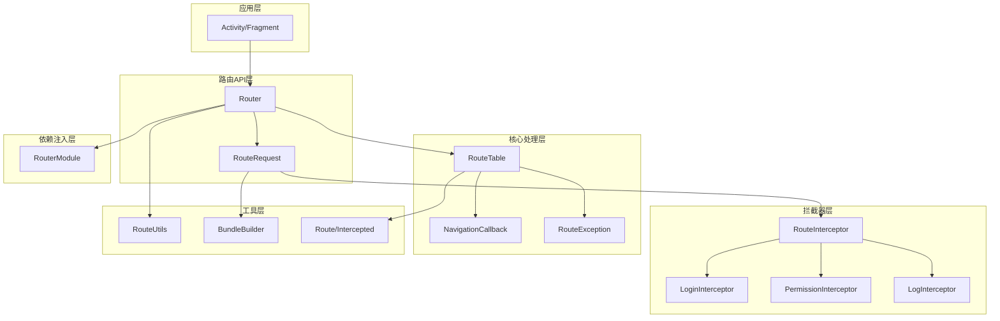

# Android自定义路由框架设计文档

## 概述

本文档描述Android自定义路由框架的技术架构设计，基于现有的Android通用框架，提供轻量级、高性能、类型安全的页面导航解决方案。

### 设计目标

1. **轻量级**：最小化框架体积和内存占用
2. **高性能**：优化路由查找和导航速度
3. **类型安全**：编译时和运行时的类型检查
4. **易扩展**：支持自定义拦截器和回调
5. **易集成**：与现有框架无缝集成

## 架构设计

### 整体架构



### 模块结构

```
core-router/
├── src/main/java/com/sword/atlas/core/router/
│   ├── Router.kt                    # 路由管理器（核心）
│   ├── RouteRequest.kt              # 路由请求构建器
│   ├── RouteTable.kt                # 路由表管理
│   ├── interceptor/                 # 拦截器模块
│   │   ├── RouteInterceptor.kt      # 拦截器接口
│   │   ├── LoginInterceptor.kt      # 登录检查拦截器
│   │   ├── PermissionInterceptor.kt # 权限检查拦截器
│   │   └── LogInterceptor.kt        # 日志拦截器
│   ├── callback/                    # 回调模块
│   │   ├── NavigationCallback.kt    # 导航回调接口
│   │   └── RouteResultCallback.kt   # 路由结果回调
│   ├── annotation/                  # 注解模块
│   │   ├── Route.kt                 # 路由注解
│   │   └── Intercepted.kt           # 拦截器注解
│   ├── exception/                   # 异常处理
│   │   └── RouteException.kt        # 路由异常
│   ├── util/                        # 工具类
│   │   ├── RouteUtils.kt            # 路由工具
│   │   └── BundleBuilder.kt         # Bundle构建器
│   └── di/                          # 依赖注入
│       └── RouterModule.kt          # 路由模块
├── build.gradle.kts                 # 构建配置
└── README.md                        # 使用文档
```

## 组件和接口设计

### 1. 核心路由管理器

#### Router - 路由管理器

```kotlin
/**
 * 路由管理器
 * 提供全局路由导航功能
 */
@Singleton
class Router @Inject constructor(
    private val routeTable: RouteTable,
    private val interceptorManager: InterceptorManager
) {
    
    companion object {
        @JvmStatic
        fun with(context: Context): RouteRequest {
            return RouteRequest(context, getInstance())
        }
        
        private fun getInstance(): Router {
            // 通过Hilt获取实例
            return DaggerRouterComponent.create().router()
        }
    }
    
    /**
     * 注册路由
     */
    fun register(path: String, activityClass: Class<out Activity>) {
        routeTable.register(path, activityClass)
    }
    
    /**
     * 批量注册路由
     */
    fun registerRoutes(routes: Map<String, Class<out Activity>>) {
        routes.forEach { (path, clazz) ->
            register(path, clazz)
        }
    }
    
    /**
     * 执行路由导航
     */
    internal suspend fun navigate(request: RouteRequest): Boolean {
        return try {
            // 执行拦截器链
            if (!interceptorManager.intercept(request)) {
                return false
            }
            
            // 获取目标Activity
            val activityClass = routeTable.getActivity(request.path)
                ?: throw RouteException.pathNotFound(request.path)
            
            // 构建Intent
            val intent = buildIntent(request, activityClass)
            
            // 启动Activity
            startActivity(request.context, intent, request)
            
            // 执行成功回调
            request.callback?.onSuccess(request.path)
            true
        } catch (e: Exception) {
            // 执行错误回调
            request.callback?.onError(e)
            false
        }
    }
    
    private fun buildIntent(request: RouteRequest, activityClass: Class<out Activity>): Intent {
        return Intent(request.context, activityClass).apply {
            // 添加参数
            if (request.bundle.size() > 0) {
                putExtras(request.bundle)
            }
            
            // 添加标志位
            request.flags.forEach { flag ->
                addFlags(flag)
            }
            
            // 设置启动模式
            request.launchMode?.let { mode ->
                addFlags(mode)
            }
        }
    }
    
    private fun startActivity(context: Context, intent: Intent, request: RouteRequest) {
        when {
            request.requestCode != null -> {
                (context as Activity).startActivityForResult(intent, request.requestCode!!)
            }
            request.enterAnim != null && request.exitAnim != null -> {
                context.startActivity(intent)
                (context as Activity).overridePendingTransition(request.enterAnim!!, request.exitAnim!!)
            }
            else -> {
                context.startActivity(intent)
            }
        }
    }
}
```

#### RouteTable - 路由表管理

```kotlin
/**
 * 路由表管理
 * 维护路径与Activity的映射关系
 */
@Singleton
class RouteTable @Inject constructor() {
    
    private val routes = ConcurrentHashMap<String, Class<out Activity>>()
    private val interceptors = ConcurrentHashMap<String, List<Class<out RouteInterceptor>>>()
    
    /**
     * 注册路由
     */
    fun register(path: String, activityClass: Class<out Activity>) {
        validatePath(path)
        routes[path] = activityClass
        LogUtil.d("Route registered: $path -> ${activityClass.simpleName}")
    }
    
    /**
     * 获取Activity类
     */
    fun getActivity(path: String): Class<out Activity>? {
        return routes[path]
    }
    
    /**
     * 注册路径拦截器
     */
    fun registerInterceptors(path: String, interceptorClasses: List<Class<out RouteInterceptor>>) {
        interceptors[path] = interceptorClasses
    }
    
    /**
     * 获取路径拦截器
     */
    fun getInterceptors(path: String): List<Class<out RouteInterceptor>> {
        return interceptors[path] ?: emptyList()
    }
    
    /**
     * 获取所有路由
     */
    fun getAllRoutes(): Map<String, Class<out Activity>> {
        return routes.toMap()
    }
    
    /**
     * 清空路由表
     */
    fun clear() {
        routes.clear()
        interceptors.clear()
    }
    
    /**
     * 验证路径格式
     */
    private fun validatePath(path: String) {
        if (!path.startsWith("/")) {
            throw RouteException.invalidPath("Path must start with '/'")
        }
        if (path.contains("//")) {
            throw RouteException.invalidPath("Path cannot contain '//'")
        }
    }
}
```

### 2. 路由请求构建器

#### RouteRequest - 路由请求构建器

```kotlin
/**
 * 路由请求构建器
 * 支持链式调用配置路由参数
 */
class RouteRequest internal constructor(
    internal val context: Context,
    private val router: Router
) {
    
    internal lateinit var path: String
    internal val bundle = Bundle()
    internal val flags = mutableListOf<Int>()
    internal var launchMode: Int? = null
    internal var requestCode: Int? = null
    internal var enterAnim: Int? = null
    internal var exitAnim: Int? = null
    internal var callback: NavigationCallback? = null
    
    /**
     * 设置目标路径
     */
    fun to(path: String): RouteRequest {
        this.path = path
        return this
    }
    
    /**
     * 添加字符串参数
     */
    fun withString(key: String, value: String?): RouteRequest {
        bundle.putString(key, value)
        return this
    }
    
    /**
     * 添加整数参数
     */
    fun withInt(key: String, value: Int): RouteRequest {
        bundle.putInt(key, value)
        return this
    }
    
    /**
     * 添加长整数参数
     */
    fun withLong(key: String, value: Long): RouteRequest {
        bundle.putLong(key, value)
        return this
    }
    
    /**
     * 添加布尔参数
     */
    fun withBoolean(key: String, value: Boolean): RouteRequest {
        bundle.putBoolean(key, value)
        return this
    }
    
    /**
     * 添加序列化对象参数
     */
    fun withSerializable(key: String, value: Serializable?): RouteRequest {
        bundle.putSerializable(key, value)
        return this
    }
    
    /**
     * 添加Parcelable对象参数
     */
    fun withParcelable(key: String, value: Parcelable?): RouteRequest {
        bundle.putParcelable(key, value)
        return this
    }
    
    /**
     * 批量添加参数
     */
    fun withBundle(bundle: Bundle): RouteRequest {
        this.bundle.putAll(bundle)
        return this
    }
    
    /**
     * 设置Intent标志位
     */
    fun withFlags(vararg flags: Int): RouteRequest {
        this.flags.addAll(flags.toList())
        return this
    }
    
    /**
     * 设置启动模式
     */
    fun withLaunchMode(launchMode: Int): RouteRequest {
        this.launchMode = launchMode
        return this
    }
    
    /**
     * 设置请求码
     */
    fun withRequestCode(requestCode: Int): RouteRequest {
        this.requestCode = requestCode
        return this
    }
    
    /**
     * 设置转场动画
     */
    fun withAnimation(@AnimRes enterAnim: Int, @AnimRes exitAnim: Int): RouteRequest {
        this.enterAnim = enterAnim
        this.exitAnim = exitAnim
        return this
    }
    
    /**
     * 设置导航回调
     */
    fun withCallback(callback: NavigationCallback): RouteRequest {
        this.callback = callback
        return this
    }
    
    /**
     * 执行路由导航
     */
    fun go() {
        if (!::path.isInitialized) {
            throw RouteException.invalidPath("Path not set")
        }
        
        // 在IO线程执行路由导航
        CoroutineScope(Dispatchers.IO).launch {
            router.navigate(this@RouteRequest)
        }
    }
    
    /**
     * 同步执行路由导航
     */
    suspend fun goSync(): Boolean {
        if (!::path.isInitialized) {
            throw RouteException.invalidPath("Path not set")
        }
        
        return router.navigate(this)
    }
}
```

### 3. 拦截器系统

#### RouteInterceptor - 拦截器接口

```kotlin
/**
 * 路由拦截器接口
 */
interface RouteInterceptor {
    
    /**
     * 拦截器优先级
     * 数值越小优先级越高
     */
    val priority: Int get() = 0
    
    /**
     * 拦截路由请求
     * @param request 路由请求
     * @return true继续执行，false中断路由
     */
    suspend fun intercept(request: RouteRequest): Boolean
}
```

#### InterceptorManager - 拦截器管理器

```kotlin
/**
 * 拦截器管理器
 */
@Singleton
class InterceptorManager @Inject constructor() {
    
    private val globalInterceptors = mutableListOf<RouteInterceptor>()
    private val pathInterceptors = ConcurrentHashMap<String, List<RouteInterceptor>>()
    
    /**
     * 添加全局拦截器
     */
    fun addGlobalInterceptor(interceptor: RouteInterceptor) {
        globalInterceptors.add(interceptor)
        globalInterceptors.sortBy { it.priority }
    }
    
    /**
     * 添加路径拦截器
     */
    fun addPathInterceptor(path: String, interceptor: RouteInterceptor) {
        val interceptors = pathInterceptors[path]?.toMutableList() ?: mutableListOf()
        interceptors.add(interceptor)
        interceptors.sortBy { it.priority }
        pathInterceptors[path] = interceptors
    }
    
    /**
     * 执行拦截器链
     */
    suspend fun intercept(request: RouteRequest): Boolean {
        // 执行全局拦截器
        for (interceptor in globalInterceptors) {
            if (!interceptor.intercept(request)) {
                LogUtil.d("Route intercepted by ${interceptor::class.simpleName}")
                return false
            }
        }
        
        // 执行路径拦截器
        val pathInterceptors = this.pathInterceptors[request.path] ?: emptyList()
        for (interceptor in pathInterceptors) {
            if (!interceptor.intercept(request)) {
                LogUtil.d("Route intercepted by ${interceptor::class.simpleName}")
                return false
            }
        }
        
        return true
    }
}
```

#### 内置拦截器实现

**LoginInterceptor - 登录检查拦截器**

```kotlin
/**
 * 登录检查拦截器
 */
@Singleton
class LoginInterceptor @Inject constructor(
    private val spUtil: SPUtil
) : RouteInterceptor {
    
    override val priority: Int = 100
    
    // 需要登录的路径列表
    private val loginRequiredPaths = setOf(
        "/user/profile",
        "/user/settings",
        "/order/list"
    )
    
    override suspend fun intercept(request: RouteRequest): Boolean {
        if (request.path in loginRequiredPaths) {
            val isLoggedIn = spUtil.getBoolean("is_logged_in", false)
            if (!isLoggedIn) {
                // 跳转到登录页面
                Router.with(request.context)
                    .to("/login")
                    .withString("redirect_path", request.path)
                    .go()
                return false
            }
        }
        return true
    }
}
```

**PermissionInterceptor - 权限检查拦截器**

```kotlin
/**
 * 权限检查拦截器
 */
@Singleton
class PermissionInterceptor @Inject constructor() : RouteInterceptor {
    
    override val priority: Int = 200
    
    // 权限要求映射
    private val permissionRequirements = mapOf(
        "/camera" to arrayOf(Manifest.permission.CAMERA),
        "/location" to arrayOf(
            Manifest.permission.ACCESS_FINE_LOCATION,
            Manifest.permission.ACCESS_COARSE_LOCATION
        )
    )
    
    override suspend fun intercept(request: RouteRequest): Boolean {
        val requiredPermissions = permissionRequirements[request.path]
        if (requiredPermissions != null) {
            val context = request.context
            val hasPermissions = requiredPermissions.all { permission ->
                ContextCompat.checkSelfPermission(context, permission) == PackageManager.PERMISSION_GRANTED
            }
            
            if (!hasPermissions) {
                // 请求权限或跳转到权限说明页面
                request.callback?.onError(
                    RouteException.permissionDenied("Required permissions not granted")
                )
                return false
            }
        }
        return true
    }
}
```

**LogInterceptor - 日志拦截器**

```kotlin
/**
 * 日志拦截器
 */
@Singleton
class LogInterceptor @Inject constructor() : RouteInterceptor {
    
    override val priority: Int = Int.MAX_VALUE // 最低优先级，最后执行
    
    override suspend fun intercept(request: RouteRequest): Boolean {
        val startTime = System.currentTimeMillis()
        
        LogUtil.d("Route navigation started: ${request.path}")
        LogUtil.d("Route parameters: ${request.bundle}")
        
        // 记录导航耗时（这里只是记录开始时间，实际耗时需要在导航完成后计算）
        request.bundle.putLong("_route_start_time", startTime)
        
        return true
    }
}
```
### 4. 
回调机制

#### NavigationCallback - 导航回调接口

```kotlin
/**
 * 导航回调接口
 */
interface NavigationCallback {
    
    /**
     * 导航成功回调
     */
    fun onSuccess(path: String) {}
    
    /**
     * 导航失败回调
     */
    fun onError(exception: Exception) {}
    
    /**
     * 导航取消回调
     */
    fun onCancel(path: String) {}
}
```

#### RouteResultCallback - 路由结果回调

```kotlin
/**
 * 路由结果回调接口
 * 用于处理startActivityForResult的结果
 */
interface RouteResultCallback {
    
    /**
     * Activity结果回调
     */
    fun onActivityResult(requestCode: Int, resultCode: Int, data: Intent?)
}

/**
 * 路由结果管理器
 */
@Singleton
class RouteResultManager @Inject constructor() {
    
    private val callbacks = ConcurrentHashMap<Int, RouteResultCallback>()
    
    /**
     * 注册结果回调
     */
    fun registerCallback(requestCode: Int, callback: RouteResultCallback) {
        callbacks[requestCode] = callback
    }
    
    /**
     * 处理Activity结果
     */
    fun handleActivityResult(requestCode: Int, resultCode: Int, data: Intent?) {
        callbacks[requestCode]?.onActivityResult(requestCode, resultCode, data)
        callbacks.remove(requestCode) // 一次性回调
    }
    
    /**
     * 移除回调
     */
    fun removeCallback(requestCode: Int) {
        callbacks.remove(requestCode)
    }
}
```

### 5. 注解支持

#### Route - 路由注解

```kotlin
/**
 * 路由注解
 * 用于标记Activity的路由路径
 */
@Target(AnnotationTarget.CLASS)
@Retention(AnnotationRetention.RUNTIME)
annotation class Route(
    /**
     * 路由路径
     */
    val path: String,
    
    /**
     * 路由描述
     */
    val description: String = "",
    
    /**
     * 是否需要登录
     */
    val requireLogin: Boolean = false,
    
    /**
     * 所需权限
     */
    val permissions: Array<String> = [],
    
    /**
     * 拦截器类列表
     */
    val interceptors: Array<KClass<out RouteInterceptor>> = []
)
```

#### Intercepted - 拦截器注解

```kotlin
/**
 * 拦截器注解
 * 用于为特定路径配置拦截器
 */
@Target(AnnotationTarget.CLASS)
@Retention(AnnotationRetention.RUNTIME)
annotation class Intercepted(
    /**
     * 拦截器类列表
     */
    val value: Array<KClass<out RouteInterceptor>>
)
```

#### AnnotationProcessor - 注解处理器

```kotlin
/**
 * 注解处理器
 * 扫描并注册带有@Route注解的Activity
 */
@Singleton
class AnnotationProcessor @Inject constructor(
    private val routeTable: RouteTable,
    private val interceptorManager: InterceptorManager
) {
    
    /**
     * 扫描并注册路由
     */
    fun scanAndRegister(packageName: String) {
        try {
            val context = ApplicationProvider.getApplicationContext<Context>()
            val packageManager = context.packageManager
            val packageInfo = packageManager.getPackageInfo(packageName, PackageManager.GET_ACTIVITIES)
            
            packageInfo.activities?.forEach { activityInfo ->
                val activityClass = Class.forName(activityInfo.name)
                processActivity(activityClass)
            }
        } catch (e: Exception) {
            LogUtil.e("Failed to scan routes", e)
        }
    }
    
    /**
     * 处理单个Activity
     */
    private fun processActivity(activityClass: Class<*>) {
        val routeAnnotation = activityClass.getAnnotation(Route::class.java)
        if (routeAnnotation != null) {
            // 注册路由
            @Suppress("UNCHECKED_CAST")
            routeTable.register(routeAnnotation.path, activityClass as Class<out Activity>)
            
            // 注册拦截器
            routeAnnotation.interceptors.forEach { interceptorClass ->
                try {
                    val interceptor = interceptorClass.java.getDeclaredConstructor().newInstance()
                    interceptorManager.addPathInterceptor(routeAnnotation.path, interceptor)
                } catch (e: Exception) {
                    LogUtil.e("Failed to create interceptor: ${interceptorClass.simpleName}", e)
                }
            }
            
            LogUtil.d("Route registered from annotation: ${routeAnnotation.path} -> ${activityClass.simpleName}")
        }
    }
}
```

### 6. 异常处理

#### RouteException - 路由异常

```kotlin
/**
 * 路由异常
 */
sealed class RouteException(
    message: String,
    cause: Throwable? = null
) : Exception(message, cause) {
    
    /**
     * 路径不存在异常
     */
    class PathNotFoundException(path: String) : RouteException("Path not found: $path")
    
    /**
     * Activity不存在异常
     */
    class ActivityNotFoundException(className: String) : RouteException("Activity not found: $className")
    
    /**
     * 参数类型错误异常
     */
    class ParameterTypeException(key: String, expectedType: String, actualType: String) : 
        RouteException("Parameter type mismatch for key '$key': expected $expectedType, got $actualType")
    
    /**
     * 权限不足异常
     */
    class PermissionDeniedException(permission: String) : RouteException("Permission denied: $permission")
    
    /**
     * 路径格式错误异常
     */
    class InvalidPathException(path: String, reason: String) : RouteException("Invalid path '$path': $reason")
    
    /**
     * 拦截器异常
     */
    class InterceptorException(interceptorName: String, cause: Throwable) : 
        RouteException("Interceptor error in $interceptorName", cause)
    
    companion object {
        fun pathNotFound(path: String) = PathNotFoundException(path)
        fun activityNotFound(className: String) = ActivityNotFoundException(className)
        fun parameterTypeMismatch(key: String, expectedType: String, actualType: String) = 
            ParameterTypeException(key, expectedType, actualType)
        fun permissionDenied(permission: String) = PermissionDeniedException(permission)
        fun invalidPath(reason: String) = InvalidPathException("", reason)
        fun interceptorError(interceptorName: String, cause: Throwable) = 
            InterceptorException(interceptorName, cause)
    }
}
```

#### FallbackHandler - 降级处理器

```kotlin
/**
 * 降级处理器
 */
@Singleton
class FallbackHandler @Inject constructor() {
    
    private var fallbackActivity: Class<out Activity>? = null
    private var enableFallback = true
    
    /**
     * 设置降级页面
     */
    fun setFallbackActivity(activityClass: Class<out Activity>) {
        this.fallbackActivity = activityClass
    }
    
    /**
     * 启用/禁用降级模式
     */
    fun setFallbackEnabled(enabled: Boolean) {
        this.enableFallback = enabled
    }
    
    /**
     * 处理路由失败
     */
    fun handleRouteFailed(context: Context, originalPath: String, exception: RouteException) {
        if (enableFallback && fallbackActivity != null) {
            try {
                val intent = Intent(context, fallbackActivity).apply {
                    putExtra("original_path", originalPath)
                    putExtra("error_message", exception.message)
                }
                context.startActivity(intent)
                LogUtil.d("Fallback to ${fallbackActivity!!.simpleName} for failed route: $originalPath")
            } catch (e: Exception) {
                LogUtil.e("Fallback failed", e)
            }
        } else {
            LogUtil.e("Route failed and no fallback configured: $originalPath", exception)
        }
    }
}
```

### 7. 工具类

#### BundleBuilder - Bundle构建器

```kotlin
/**
 * Bundle构建器
 * 提供类型安全的Bundle构建
 */
class BundleBuilder {
    
    private val bundle = Bundle()
    
    fun putString(key: String, value: String?): BundleBuilder {
        bundle.putString(key, value)
        return this
    }
    
    fun putInt(key: String, value: Int): BundleBuilder {
        bundle.putInt(key, value)
        return this
    }
    
    fun putLong(key: String, value: Long): BundleBuilder {
        bundle.putLong(key, value)
    }
    
    fun putFloat(key: String, value: Float): BundleBuilder {
        bundle.putFloat(key, value)
        return this
    }
    
    fun putDouble(key: String, value: Double): BundleBuilder {
        bundle.putDouble(key, value)
        return this
    }
    
    fun putBoolean(key: String, value: Boolean): BundleBuilder {
        bundle.putBoolean(key, value)
        return this
    }
    
    fun putStringArray(key: String, value: Array<String>?): BundleBuilder {
        bundle.putStringArray(key, value)
        return this
    }
    
    fun putIntArray(key: String, value: IntArray?): BundleBuilder {
        bundle.putIntArray(key, value)
        return this
    }
    
    fun putSerializable(key: String, value: Serializable?): BundleBuilder {
        bundle.putSerializable(key, value)
        return this
    }
    
    fun putParcelable(key: String, value: Parcelable?): BundleBuilder {
        bundle.putParcelable(key, value)
        return this
    }
    
    fun putParcelableArrayList(key: String, value: ArrayList<out Parcelable>?): BundleBuilder {
        bundle.putParcelableArrayList(key, value)
        return this
    }
    
    fun build(): Bundle {
        return Bundle(bundle)
    }
    
    companion object {
        fun create(): BundleBuilder = BundleBuilder()
    }
}
```

#### RouteUtils - 路由工具类

```kotlin
/**
 * 路由工具类
 */
object RouteUtils {
    
    /**
     * 验证路径格式
     */
    fun validatePath(path: String): Boolean {
        return path.startsWith("/") && !path.contains("//") && path.matches(Regex("^/[a-zA-Z0-9/_-]*$"))
    }
    
    /**
     * 解析路径参数
     */
    fun parsePathParams(path: String): Map<String, String> {
        val params = mutableMapOf<String, String>()
        val segments = path.split("/")
        
        for (i in segments.indices) {
            val segment = segments[i]
            if (segment.startsWith(":")) {
                val key = segment.substring(1)
                if (i + 1 < segments.size) {
                    params[key] = segments[i + 1]
                }
            }
        }
        
        return params
    }
    
    /**
     * 导出路由表为JSON
     */
    fun exportRouteTable(routeTable: RouteTable): String {
        val routes = routeTable.getAllRoutes()
        val jsonObject = JSONObject()
        
        routes.forEach { (path, activityClass) ->
            jsonObject.put(path, activityClass.name)
        }
        
        return jsonObject.toString(2)
    }
    
    /**
     * 从JSON导入路由表
     */
    fun importRouteTable(json: String, routeTable: RouteTable) {
        try {
            val jsonObject = JSONObject(json)
            val keys = jsonObject.keys()
            
            while (keys.hasNext()) {
                val path = keys.next()
                val className = jsonObject.getString(path)
                
                @Suppress("UNCHECKED_CAST")
                val activityClass = Class.forName(className) as Class<out Activity>
                routeTable.register(path, activityClass)
            }
        } catch (e: Exception) {
            LogUtil.e("Failed to import route table", e)
        }
    }
    
    /**
     * 获取Activity的路由路径
     */
    fun getRoutePath(activityClass: Class<out Activity>): String? {
        val routeAnnotation = activityClass.getAnnotation(Route::class.java)
        return routeAnnotation?.path
    }
    
    /**
     * 检查路径是否需要登录
     */
    fun requiresLogin(activityClass: Class<out Activity>): Boolean {
        val routeAnnotation = activityClass.getAnnotation(Route::class.java)
        return routeAnnotation?.requireLogin ?: false
    }
    
    /**
     * 获取路径所需权限
     */
    fun getRequiredPermissions(activityClass: Class<out Activity>): Array<String> {
        val routeAnnotation = activityClass.getAnnotation(Route::class.java)
        return routeAnnotation?.permissions ?: emptyArray()
    }
}
```

### 8. 依赖注入

#### RouterModule - Hilt模块

```kotlin
/**
 * 路由模块
 * 提供路由相关的依赖注入
 */
@Module
@InstallIn(SingletonComponent::class)
object RouterModule {
    
    @Provides
    @Singleton
    fun provideRouteTable(): RouteTable {
        return RouteTable()
    }
    
    @Provides
    @Singleton
    fun provideInterceptorManager(): InterceptorManager {
        return InterceptorManager()
    }
    
    @Provides
    @Singleton
    fun provideRouteResultManager(): RouteResultManager {
        return RouteResultManager()
    }
    
    @Provides
    @Singleton
    fun provideFallbackHandler(): FallbackHandler {
        return FallbackHandler()
    }
    
    @Provides
    @Singleton
    fun provideAnnotationProcessor(
        routeTable: RouteTable,
        interceptorManager: InterceptorManager
    ): AnnotationProcessor {
        return AnnotationProcessor(routeTable, interceptorManager)
    }
    
    @Provides
    @Singleton
    fun provideRouter(
        routeTable: RouteTable,
        interceptorManager: InterceptorManager
    ): Router {
        return Router(routeTable, interceptorManager)
    }
    
    @Provides
    @Singleton
    fun provideLoginInterceptor(spUtil: SPUtil): LoginInterceptor {
        return LoginInterceptor(spUtil)
    }
    
    @Provides
    @Singleton
    fun providePermissionInterceptor(): PermissionInterceptor {
        return PermissionInterceptor()
    }
    
    @Provides
    @Singleton
    fun provideLogInterceptor(): LogInterceptor {
        return LogInterceptor()
    }
}
```

## 数据模型

### 路由信息模型

```kotlin
/**
 * 路由信息
 */
data class RouteInfo(
    val path: String,
    val activityClass: Class<out Activity>,
    val description: String = "",
    val requireLogin: Boolean = false,
    val permissions: Array<String> = emptyArray(),
    val interceptors: List<Class<out RouteInterceptor>> = emptyList()
) {
    override fun equals(other: Any?): Boolean {
        if (this === other) return true
        if (javaClass != other?.javaClass) return false
        
        other as RouteInfo
        
        if (path != other.path) return false
        if (activityClass != other.activityClass) return false
        if (description != other.description) return false
        if (requireLogin != other.requireLogin) return false
        if (!permissions.contentEquals(other.permissions)) return false
        if (interceptors != other.interceptors) return false
        
        return true
    }
    
    override fun hashCode(): Int {
        var result = path.hashCode()
        result = 31 * result + activityClass.hashCode()
        result = 31 * result + description.hashCode()
        result = 31 * result + requireLogin.hashCode()
        result = 31 * result + permissions.contentHashCode()
        result = 31 * result + interceptors.hashCode()
        return result
    }
}
```

### 导航统计模型

```kotlin
/**
 * 导航统计信息
 */
data class NavigationStats(
    val path: String,
    val count: Int = 0,
    val totalTime: Long = 0L,
    val averageTime: Long = 0L,
    val lastNavigationTime: Long = 0L
)
```

## 性能优化策略

### 1. 路由表优化

- 使用`ConcurrentHashMap`实现O(1)时间复杂度的路由查找
- 路由表预加载，避免运行时反射扫描
- 支持路由表缓存，减少重复初始化

### 2. 拦截器优化

- 拦截器按优先级排序，避免每次执行时排序
- 支持异步拦截器，避免阻塞主线程
- 拦截器结果缓存，相同条件下复用结果

### 3. 参数传递优化

- 使用Bundle进行参数传递，避免序列化开销
- 大对象使用弱引用缓存，避免内存泄漏
- 参数类型检查前置，减少运行时异常

### 4. 内存优化

- 路由表使用弱引用，避免Activity泄漏
- 回调使用弱引用，避免内存泄漏
- 及时清理临时对象和缓存

## 测试策略

### 单元测试

**测试范围**
- Router核心功能测试
- RouteTable路由注册和查找测试
- 拦截器链执行测试
- 参数传递和类型安全测试
- 异常处理测试

**测试框架**
- JUnit 4.13.2
- MockK 1.13.8
- Robolectric 4.10.3（Android组件测试）
- Coroutines Test 1.9.0

### 集成测试

**测试场景**
- 完整路由导航流程测试
- 拦截器与路由的集成测试
- 注解处理器测试
- Hilt依赖注入测试

### 性能测试

**测试指标**
- 路由表初始化时间 < 50ms
- 单次路由导航时间 < 100ms
- 拦截器链执行时间 < 50ms
- 内存占用 < 5MB

## 使用示例

### 基础使用

```kotlin
// 简单导航
Router.with(this).to("/user/profile").go()

// 带参数导航
Router.with(this)
    .to("/user/detail")
    .withLong("userId", 123L)
    .withString("userName", "张三")
    .go()

// 带回调导航
Router.with(this)
    .to("/login")
    .withCallback(object : NavigationCallback {
        override fun onSuccess(path: String) {
            // 导航成功
        }
        
        override fun onError(exception: Exception) {
            // 导航失败
        }
    })
    .go()
```

### 高级使用

```kotlin
// 带拦截器和动画的导航
Router.with(this)
    .to("/camera")
    .withAnimation(R.anim.slide_in_right, R.anim.slide_out_left)
    .withFlags(Intent.FLAG_ACTIVITY_CLEAR_TOP)
    .go()

// startActivityForResult
Router.with(this)
    .to("/select/image")
    .withRequestCode(REQUEST_SELECT_IMAGE)
    .go()
```

### 注解使用

```kotlin
@Route(
    path = "/user/profile",
    description = "用户资料页面",
    requireLogin = true,
    permissions = [Manifest.permission.CAMERA],
    interceptors = [LoginInterceptor::class, PermissionInterceptor::class]
)
class UserProfileActivity : BaseVMActivity<ActivityUserProfileBinding, UserProfileViewModel>() {
    // Activity实现
}
```

## 总结

本设计文档详细描述了Android自定义路由框架的技术架构，包括：

1. **模块化设计**：清晰的模块划分和职责分离
2. **高性能实现**：优化的数据结构和算法
3. **类型安全**：编译时和运行时的类型检查
4. **易扩展性**：灵活的拦截器和回调机制
5. **易集成性**：与现有框架的无缝集成

该框架将为Android应用提供强大、灵活、高性能的路由导航能力。