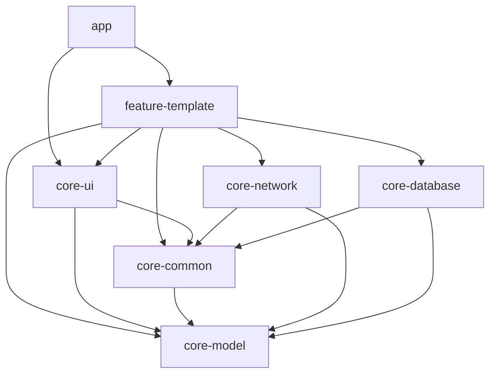

# Android通用框架开发任务清单

## 📋 项目概述

构建生产级Android通用开发框架，采用MVVM + Clean Architecture，支持快速开发企业级应用。

------

## 🎯 阶段一：架构设计（优先完成）

### 1.1 整体架构设计

-  绘制模块依赖关系图（Mermaid）
-  说明技术选型理由
-  定义完整目录结构
-  设计Gradle配置策略

### 1.2 技术栈确认

-  Kotlin 100%覆盖
-  MVVM + Clean Architecture模式
-  Kotlin Flow替代LiveData
-  Hilt依赖注入
-  Retrofit + OkHttp网络层
-  Room数据库 + KSP
-  Coroutines异步处理
-  ViewBinding视图绑定
-  SDK版本：最低API 24，目标API 36
-  Gradle Version Catalog依赖管理

### 1.3 项目配置说明

-  **项目名称**：Atlas
-  **根包名**：`com.sword.atlas`
-  **模块包名规范**：
   -  核心模块：`com.sword.atlas.core.{module}`
   -  功能模块：`com.sword.atlas.feature.{feature}`
   -  应用模块：`com.sword.atlas`
-  **编译配置**：
   -  compileSdk = 36
   -  targetSdk = 36
   -  minSdk = 24
   -  jvmTarget = "11"

### 1.4 模块依赖关系



**依赖层级说明：**
- **app**：主应用模块，依赖所有功能模块
- **feature-***：功能模块，可依赖所有core模块，禁止相互依赖
- **core-ui**：UI组件，依赖core-common和core-model
- **core-network/database**：数据层，依赖core-common和core-model
- **core-common**：基础工具，依赖core-model
- **core-model**：数据模型，最底层，不依赖任何业务模块

------

## 🏗️ 阶段二：核心模块实现

### 2.1 Gradle配置（依赖版本管理）

**优先级：🔴 最高**

-  扩展`gradle/libs.versions.toml`
  -  添加Hilt版本
  -  添加Retrofit/OkHttp版本
  -  添加Room版本
  -  添加Coroutines版本
  -  添加其他必要库版本

-  配置根目录`build.gradle.kts`
  -  添加Hilt插件（apply false）
  -  添加KSP插件（apply false）
  -  添加Android Library插件（apply false）

-  更新`settings.gradle.kts`
  -  添加所有模块的include声明
  -  配置模块依赖关系

-  创建`gradle/plugins.gradle.kts`（可选）
  -  定义通用插件配置

**交付物：**

```
gradle/
├── libs.versions.toml（扩展）
└── wrapper/
    ├── gradle-wrapper.jar
    └── gradle-wrapper.properties

build.gradle.kts（更新）
```

**验收标准：**
- ✅ Gradle Sync成功，无错误提示
- ✅ 所有依赖版本在libs.versions.toml中统一管理
- ✅ 插件版本与Kotlin版本兼容
- ✅ 无循环依赖警告
- ✅ 所有模块在settings.gradle.kts中正确声明

**检查点：**
1. 执行 `./gradlew clean` 成功
2. 执行 `./gradlew build --dry-run` 无错误
3. Android Studio中Gradle面板显示所有模块
4. 依赖版本冲突检查：`./gradlew app:dependencies`

------

### 2.2 core-model模块（数据模型）

**优先级：🔴 最高**

-  创建Android Library模块
-  基础模型类
  -  `ApiResponse<T>`：统一API响应包装
  -  `DataResult<T>`：业务结果封装
  -  `UiState<T>`：UI状态密封类（Loading/Success/Error）
  -  `PageData<T>`：分页数据模型
-  错误码枚举`ErrorCode`
-  创建`build.gradle.kts`
  -  应用`com.android.library`插件
  -  应用`kotlin-android`插件

**交付物：**

```
core-model/
├── build.gradle.kts
└── src/main/java/com/sword/atlas/core/model/
    ├── ApiResponse.kt
    ├── DataResult.kt
    ├── UiState.kt
    ├── PageData.kt
    └── ErrorCode.kt
```

**验收标准：**
- ✅ 模块独立编译成功：`./gradlew :core-model:build`
- ✅ 所有类都有完整的KDoc注释
- ✅ 数据类正确实现equals/hashCode/toString
- ✅ 密封类正确使用sealed关键字
- ✅ 无Lint警告（Warning级别以上）
- ✅ 包名符合规范：com.sword.atlas.core.model

**检查点：**
1. ApiResponse支持泛型且包含code/message/data字段
2. Result类正确处理Success/Error状态
3. UiState密封类包含Loading/Success/Error状态
4. ErrorCode枚举包含常见错误码
5. 所有类可序列化（实现Serializable或Parcelable）

------

### 2.3 core-network模块（网络层）

**优先级：🔴 最高**

-  Retrofit配置
  -  `RetrofitClient`单例
  -  支持多BaseUrl切换
  -  添加Gson转换器
-  OkHttp拦截器
  -  `LoggingInterceptor`：日志拦截
  -  `TokenInterceptor`：Token自动注入
  -  `SignInterceptor`：签名拦截器
-  Flow扩展函数
  -  `flowRequest{}`：统一网络请求包装
  -  全局错误处理
  -  自动转换`DataResult<T>`
-  下载上传工具
  -  `DownloadManager`：下载进度监听
  -  `UploadManager`：上传进度监听
-  Hilt注入配置
  -  `NetworkModule`

**交付物：**

```
core-network/
├── build.gradle.kts
└── src/main/java/com/sword/atlas/core/network/
    ├── RetrofitClient.kt
    ├── interceptor/
    │   ├── LoggingInterceptor.kt
    │   ├── TokenInterceptor.kt
    │   └── SignInterceptor.kt
    ├── extension/
    │   └── FlowExt.kt
    ├── download/
    │   └── DownloadManager.kt
    ├── upload/
    │   └── UploadManager.kt
    └── di/
        └── NetworkModule.kt
```

**验收标准：**
- ✅ 模块编译成功，依赖core-model和core-common
- ✅ Retrofit实例可正常创建和配置
- ✅ 拦截器正确添加到OkHttp客户端
- ✅ Flow扩展函数能正确处理网络异常
- ✅ Hilt模块正确提供网络相关依赖
- ✅ 支持多环境BaseUrl切换
- ✅ 网络请求超时配置合理（连接15s，读取30s，写入30s）

**检查点：**
1. RetrofitClient单例模式实现正确
2. LoggingInterceptor在Debug模式下输出完整日志
3. TokenInterceptor能自动添加Authorization头
4. flowRequest{}扩展函数能捕获并转换异常
5. NetworkModule使用@Singleton注解
6. 下载/上传进度回调正常工作
7. 网络异常映射到ErrorCode正确

------

### 2.4 core-database模块（数据库层）

**优先级：🟡 高**

-  Room配置（使用KSP）
  -  `AppDatabase`抽象类
  -  数据库版本管理
  -  迁移策略`MIGRATION_1_2`
-  BaseDao
  -  通用CRUD操作
  -  Flow响应式查询
-  实体示例
  -  `UserEntity`示例实体
-  Hilt注入配置
  -  `DatabaseModule`
-  build.gradle.kts配置
  -  应用KSP插件
  -  添加Room依赖

**交付物：**

```
core-database/
├── build.gradle.kts
└── src/main/java/com/sword/atlas/core/database/
    ├── AppDatabase.kt
    ├── BaseDao.kt
    ├── entity/
    │   └── UserEntity.kt
    ├── dao/
    │   └── UserDao.kt
    └── di/
        └── DatabaseModule.kt
```

**验收标准：**
- ✅ KSP注解处理器正常工作，生成Room相关代码
- ✅ 数据库版本管理策略清晰
- ✅ 迁移脚本测试通过
- ✅ BaseDao提供完整CRUD操作
- ✅ 所有Dao方法返回Flow类型
- ✅ 数据库实例通过Hilt正确注入
- ✅ 数据库文件加密配置（生产环境）

**检查点：**
1. AppDatabase继承RoomDatabase且使用@Database注解
2. 数据库版本号正确设置
3. MIGRATION_1_2迁移脚本语法正确
4. UserEntity使用@Entity注解且主键正确
5. UserDao继承BaseDao且方法签名正确
6. DatabaseModule提供单例数据库实例
7. 数据库操作在IO线程执行
8. Room编译时无警告信息

------

### 2.5 core-common模块（基础架构）

**优先级：🔴 最高**

-  基础架构类
  -  `BaseViewModel`：统一状态管理
  -  `BaseRepository`：数据仓库模板
-  Kotlin扩展函数
  -  `StringExt.kt`：字符串扩展
  -  `ContextExt.kt`：Context扩展
  -  `ViewExt.kt`：View扩展
  -  `FlowExt.kt`：Flow扩展（状态收集、错误处理）
-  通用工具类
  -  `LogUtil`：日志工具（支持开发/生产环境切换）
  -  `SPUtil`：SharedPreferences封装
  -  `JsonUtil`：JSON解析工具（Gson封装）
  -  `ToastUtil`：Toast工具
  -  `DateUtil`：日期工具
  -  `NetworkUtil`：网络状态检测
-  协程和异常处理
  -  `DispatcherProvider`：协程调度器提供者
  -  `ExceptionHandler`：全局异常处理
  -  `ErrorMapper`：错误映射工具
-  常量定义
  -  `AppConstants`：应用常量

**交付物：**

```
core-common/
├── build.gradle.kts
└── src/main/java/com/sword/atlas/core/common/
    ├── base/
    │   ├── BaseViewModel.kt
    │   └── BaseRepository.kt
    ├── extension/
    │   ├── StringExt.kt
    │   ├── ContextExt.kt
    │   ├── ViewExt.kt
    │   └── FlowExt.kt
    ├── util/
    │   ├── LogUtil.kt
    │   ├── SPUtil.kt
    │   ├── JsonUtil.kt
    │   ├── ToastUtil.kt
    │   ├── DateUtil.kt
    │   └── NetworkUtil.kt
    ├── coroutine/
    │   ├── DispatcherProvider.kt
    │   ├── ExceptionHandler.kt
    │   └── ErrorMapper.kt
    └── constant/
        └── AppConstants.kt
```

**验收标准：**
- ✅ BaseViewModel正确使用viewModelScope
- ✅ BaseRepository提供统一的数据访问模式
- ✅ 所有扩展函数都有单元测试
- ✅ 工具类支持空安全操作
- ✅ 协程异常处理机制完善
- ✅ 日志工具支持不同级别和环境切换
- ✅ 常量定义遵循命名规范

**检查点：**
1. BaseViewModel包含loading状态管理
2. BaseRepository实现Result包装模式
3. 扩展函数覆盖常用场景（非空判断、格式化等）
4. LogUtil支持Debug/Release环境区分
5. SPUtil提供类型安全的存取方法
6. JsonUtil正确处理序列化异常
7. DispatcherProvider便于测试时Mock
8. ExceptionHandler能捕获并转换所有异常类型
9. 所有工具类都是object或包含静态方法

------

### 2.6 core-ui模块（UI组件）

**优先级：🟡 高**

-  基础Activity/Fragment
  -  `BaseActivity`：通用Activity基类
  -  `BaseFragment`：通用Fragment基类
  -  `BaseVMActivity`：带ViewModel的Activity（支持Hilt）
  -  `BaseVMFragment`：带ViewModel的Fragment（支持Hilt）
-  通用Dialog
  -  `LoadingDialog`：加载对话框
  -  `CommonDialog`：通用对话框
-  通用状态View
  -  `EmptyView`：空数据视图
  -  `ErrorView`：错误视图
  -  `StateLayout`：状态布局容器
-  RecyclerView组件
  -  `BaseAdapter`：通用Adapter
  -  `BaseViewHolder`：通用ViewHolder
  -  `MultiTypeAdapter`：多类型Adapter
-  自定义控件
  -  `TitleBar`：标题栏
  -  `LoadingButton`：带加载状态按钮
-  布局文件
  -  对应XML布局资源
-  ViewBinding配置
  -  启用ViewBinding
  -  创建ViewBinding扩展函数

**交付物：**

```
core-ui/
├── build.gradle.kts
└── src/main/
    ├── java/com/sword/atlas/core/ui/
    │   ├── base/
    │   │   ├── BaseActivity.kt
    │   │   ├── BaseFragment.kt
    │   │   ├── BaseVMActivity.kt
    │   │   └── BaseVMFragment.kt
    │   ├── dialog/
    │   │   ├── LoadingDialog.kt
    │   │   └── CommonDialog.kt
    │   ├── widget/
    │   │   ├── EmptyView.kt
    │   │   ├── ErrorView.kt
    │   │   ├── StateLayout.kt
    │   │   ├── TitleBar.kt
    │   │   └── LoadingButton.kt
    │   ├── adapter/
    │   │   ├── BaseAdapter.kt
    │   │   ├── BaseViewHolder.kt
    │   │   └── MultiTypeAdapter.kt
    │   └── extension/
    │       └── ViewBindingExt.kt
    └── res/
        ├── layout/
        │   ├── layout_loading_dialog.xml
        │   ├── layout_common_dialog.xml
        │   ├── layout_empty_view.xml
        │   ├── layout_error_view.xml
        │   └── layout_title_bar.xml
        ├── values/
        │   ├── colors.xml
        │   ├── dimens.xml
        │   └── strings.xml
        └── drawable/
            └── [相关drawable资源]
```

**验收标准：**
- ✅ ViewBinding在所有Activity/Fragment中正常工作
- ✅ 基类正确处理生命周期和内存泄漏
- ✅ 自定义控件支持属性配置
- ✅ Adapter支持DiffUtil提升性能
- ✅ 状态布局能正确切换Loading/Success/Error状态
- ✅ 所有布局文件遵循Material Design规范
- ✅ 资源文件命名规范且无重复

**检查点：**
1. BaseActivity/Fragment正确使用@AndroidEntryPoint
2. BaseVMActivity/Fragment正确绑定ViewModel
3. ViewBinding扩展函数简化初始化代码
4. LoadingDialog支持取消和自定义样式
5. StateLayout能响应UiState变化
6. TitleBar支持左右按钮和标题配置
7. BaseAdapter实现DiffUtil.ItemCallback
8. 所有自定义View支持预览模式
9. 颜色值使用主题属性而非硬编码
10. 布局文件通过Lint检查无警告

------

### 2.7 feature-template模块（功能模板）

**优先级：🟢 中**

-  完整登录功能示例
  -  `LoginActivity`：登录界面
  -  `LoginViewModel`：登录逻辑
  -  `LoginRepository`：登录数据仓库
  -  `LoginApi`：登录API接口
  -  `LoginRequest/Response`：请求响应模型
  -  布局文件
-  列表功能示例
  -  `UserListFragment`：用户列表
  -  `UserListViewModel`
  -  支持分页加载
  -  支持下拉刷新
-  详情功能示例
  -  `UserDetailActivity`
  -  `UserDetailViewModel`

**交付物：**

```
feature-template/
├── build.gradle.kts
└── src/main/
    ├── java/com/sword/atlas/feature/template/
    │   ├── login/
    │   │   ├── LoginActivity.kt
    │   │   ├── LoginViewModel.kt
    │   │   ├── LoginRepository.kt
    │   │   ├── LoginApi.kt
    │   │   └── model/
    │   │       ├── LoginRequest.kt
    │   │       └── LoginResponse.kt
    │   ├── list/
    │   │   ├── UserListFragment.kt
    │   │   ├── UserListViewModel.kt
    │   │   ├── UserListRepository.kt
    │   │   └── adapter/
    │   │       └── UserListAdapter.kt
    │   └── detail/
    │       ├── UserDetailActivity.kt
    │       └── UserDetailViewModel.kt
    └── res/
        └── layout/
            ├── activity_login.xml
            ├── fragment_user_list.xml
            ├── activity_user_detail.xml
            └── item_user.xml
```

**验收标准：**
- ✅ 登录功能完整可用（UI交互+网络请求+状态管理）
- ✅ 列表支持分页加载和下拉刷新
- ✅ 详情页面正确接收和显示数据
- ✅ 所有ViewModel正确使用Hilt注入
- ✅ Repository层正确封装数据访问逻辑
- ✅ 错误处理和Loading状态完善
- ✅ 代码可作为其他功能模块的参考模板

**检查点：**
1. 登录表单验证逻辑正确
2. 网络请求成功/失败都有相应UI反馈
3. 用户列表支持上拉加载更多
4. 列表项点击能正确跳转详情页
5. ViewModel中正确使用StateFlow管理状态
6. Repository正确组合网络和本地数据
7. 所有异步操作都在正确的协程作用域中
8. 布局适配不同屏幕尺寸
9. 无内存泄漏和ANR问题
10. 功能演示完整的MVVM架构模式

------

### 2.8 app模块（主应用）

**优先级：🟢 中**

-  Application配置
  -  `App`类：Application初始化
  -  `@HiltAndroidApp`注解
  -  全局配置初始化（日志、崩溃收集等）
-  MainActivity示例
  -  `@AndroidEntryPoint`注解
  -  导航到功能模块
  -  演示框架使用
-  AndroidManifest配置
  -  权限声明（网络、存储等）
  -  Application配置
  -  Activity注册
-  build.gradle.kts
  -  应用Hilt插件
  -  依赖所有core和feature模块
  -  配置签名
  -  配置ProGuard/R8规则
  -  启用ViewBinding

**交付物：**

```
app/
├── build.gradle.kts
├── proguard-rules.pro
└── src/main/
    ├── java/com/sword/atlas/
    │   ├── App.kt
    │   └── MainActivity.kt
    ├── res/
    │   ├── layout/
    │   │   └── activity_main.xml
    │   ├── values/
    │   │   ├── strings.xml
    │   │   ├── colors.xml
    │   │   └── themes.xml
    │   └── mipmap/
    │       └── [应用图标]
    └── AndroidManifest.xml
```

**验收标准：**
- ✅ 应用正常启动，无崩溃
- ✅ Hilt依赖注入正常工作
- ✅ 所有功能模块集成成功
- ✅ Release包正常打包和安装
- ✅ 混淆后功能正常
- ✅ 应用图标和主题正确显示
- ✅ 权限申请流程正常

**检查点：**
1. App类正确使用@HiltAndroidApp注解
2. MainActivity能正确导航到各功能模块
3. 应用启动时间 < 2秒（冷启动）
4. Debug和Release版本都能正常运行
5. 所有必要权限在AndroidManifest中声明
6. 应用在不同Android版本上兼容性良好
7. 内存占用合理（启动后 < 100MB）
8. 无内存泄漏和性能问题

------

### 2.9 混淆配置模块

**优先级：🟢 中**

-  应用模块混淆规则（proguard-rules.pro）
  -  基础混淆配置
  -  保留反射使用的类
  -  保留序列化类
-  各模块consumer-rules.pro
  -  core-model：保留数据模型
  -  core-network：保留Retrofit接口和模型
  -  core-database：保留Room实体
-  第三方库混淆规则
  -  Retrofit/OkHttp
  -  Gson
  -  Room
  -  Hilt
-  R8优化配置
  -  代码优化
  -  资源优化

**交付物：**

```
app/proguard-rules.pro
core-model/consumer-rules.pro
core-network/consumer-rules.pro
core-database/consumer-rules.pro
```

------

## ⚠️ 风险管控与应急预案

### 🔧 依赖冲突处理方案

#### 常见冲突场景
1. **Kotlin版本冲突**
   - 症状：编译时出现"Kotlin版本不兼容"错误
   - 解决：统一所有模块的Kotlin版本，检查第三方库的Kotlin依赖
   - 预防：在libs.versions.toml中统一管理Kotlin版本

2. **协程版本冲突**
   - 症状：运行时出现NoSuchMethodError或ClassNotFoundException
   - 解决：使用BOM管理协程相关依赖，强制统一版本
   - 预防：定期检查依赖树：`./gradlew app:dependencies`

3. **Hilt与其他DI框架冲突**
   - 症状：编译时注解处理器冲突
   - 解决：移除其他DI框架，统一使用Hilt
   - 预防：项目初期确定唯一DI方案

4. **Room与其他ORM冲突**
   - 症状：数据库操作异常或编译失败
   - 解决：移除其他ORM框架，统一使用Room
   - 预防：避免混用多种数据库框架

#### 冲突解决工具
```bash
# 查看依赖树
./gradlew app:dependencies

# 查看特定配置的依赖
./gradlew app:dependencies --configuration implementation

# 强制使用特定版本
implementation("com.example:library:1.0.0") {
    force = true
}

# 排除传递依赖
implementation("com.example:library:1.0.0") {
    exclude(group = "com.conflict", module = "library")
}
```

### 📱 版本兼容性问题预案

#### Android版本兼容性
| 问题类型 | 影响版本 | 解决方案 | 预防措施 |
|---------|---------|---------|---------|
| API变更 | API 24-36 | 使用@TargetApi或版本检查 | 定期测试不同API级别 |
| 权限模型 | API 23+ | 动态权限申请 | 使用权限库统一处理 |
| 网络安全 | API 28+ | 配置network_security_config | 明确声明网络策略 |
| 作用域存储 | API 29+ | 使用MediaStore API | 避免直接文件路径访问 |

#### Gradle版本兼容性
```kotlin
// gradle/wrapper/gradle-wrapper.properties
distributionUrl=https\://services.gradle.org/distributions/gradle-8.10.2-bin.zip

// build.gradle.kts (Project)
plugins {
    id("com.android.application") version "8.10.1" apply false
    id("org.jetbrains.kotlin.android") version "2.0.21" apply false
}
```

#### 依赖版本兼容性矩阵
| 组件 | 最低版本 | 推荐版本 | 最高测试版本 | 兼容性说明 |
|------|---------|---------|-------------|-----------|
| Kotlin | 2.0.0 | 2.0.21 | 2.0.21 | 与AGP 8.10.1兼容 |
| Hilt | 2.48 | 2.51 | 2.51 | 需要Kotlin 1.9+ |
| Room | 2.5.0 | 2.6.1 | 2.6.1 | 支持KSP |
| Retrofit | 2.9.0 | 2.11.0 | 2.11.0 | 支持协程 |
| Coroutines | 1.7.0 | 1.9.0 | 1.9.0 | 稳定版本 |

### 🚨 应急处理流程

#### 编译失败应急流程
1. **立即操作**
   - 执行 `./gradlew clean`
   - 重启Android Studio
   - 检查网络连接

2. **问题定位**
   - 查看完整错误日志
   - 检查最近的代码变更
   - 验证依赖版本兼容性

3. **回滚策略**
   - Git回滚到最后一个可工作版本
   - 逐步恢复变更，定位问题代码
   - 记录问题和解决方案

#### 运行时崩溃应急流程
1. **收集信息**
   - 获取完整崩溃堆栈
   - 记录复现步骤
   - 确认影响范围

2. **快速修复**
   - 添加try-catch保护关键流程
   - 使用默认值避免空指针
   - 临时禁用有问题的功能

3. **根本解决**
   - 分析崩溃原因
   - 编写单元测试验证修复
   - 更新相关文档

### 📊 质量监控指标

#### 编译性能指标
- Gradle Sync时间 < 40秒
- Clean Build时间 < 2分钟
- 增量编译时间 < 40秒
- APK大小 < 50MB（Debug版本）

#### 运行时性能指标
- 冷启动时间 < 2秒
- 内存占用 < 100MB（启动后）
- 主线程阻塞 < 16ms
- 网络请求超时率 < 1%

#### 代码质量指标
- Lint警告数量 = 0
- 单元测试覆盖率 > 60%（核心模块）
- 代码重复率 < 5%
- 圈复杂度 < 10（单个方法）

------

## 📚 阶段三：文档编写

### 3.1 README.md

-  项目介绍
-  技术栈说明
-  快速开始指南
-  模块说明
-  使用示例
-  贡献指南

### 3.2 开发文档

-  架构设计文档
-  编码规范文档
-  模块开发指南
-  API文档

------

## ✅ 阶段四：验收测试

### 4.1 编译验证

**必须通过的检查项：**
- ✅ `./gradlew clean build` 执行成功，耗时 < 3分钟
- ✅ `./gradlew app:assembleDebug` 生成APK成功
- ✅ `./gradlew app:assembleRelease` 生成混淆APK成功
- ✅ Android Studio Gradle Sync < 40秒
- ✅ 依赖冲突检查：`./gradlew app:dependencies` 无冲突警告
- ✅ Lint检查：`./gradlew app:lintDebug` 无Error级别问题
- ✅ 所有模块独立编译成功

**具体验证命令：**
```bash
# 完整编译验证
./gradlew clean build --info

# 依赖分析
./gradlew app:dependencies --configuration implementation

# 代码质量检查
./gradlew app:lintDebug
./gradlew app:detekt  # 如果使用detekt
```

### 4.2 功能验证

**登录模块验证清单：**
- ✅ 用户名/密码输入验证正确
- ✅ 登录按钮Loading状态正常显示
- ✅ 网络请求成功后正确跳转
- ✅ 网络请求失败显示错误提示
- ✅ Token正确保存到SharedPreferences
- ✅ 登录状态在应用重启后保持

**列表模块验证清单：**
- ✅ 初始加载显示Loading状态
- ✅ 数据加载成功显示列表内容
- ✅ 下拉刷新功能正常
- ✅ 上拉加载更多功能正常
- ✅ 空数据状态正确显示
- ✅ 网络错误状态正确显示
- ✅ 列表项点击跳转详情页正常

**网络层验证清单：**
- ✅ HTTP 200响应正确解析
- ✅ HTTP 4xx/5xx错误正确处理
- ✅ 网络超时正确处理（15s连接，30s读取）
- ✅ Token自动添加到请求头
- ✅ 请求日志在Debug模式下正确输出
- ✅ 网络异常转换为ErrorCode正确

**数据库验证清单：**
- ✅ 数据库创建和初始化成功
- ✅ CRUD操作正确执行
- ✅ 数据库迁移脚本正确执行
- ✅ Flow查询响应式更新正常
- ✅ 事务操作正确回滚

### 4.3 代码质量检查

**静态代码分析：**
- ✅ Lint检查：0个Error，Warning < 10个
- ✅ 代码格式化：使用ktlint或Android Studio格式化
- ✅ 命名规范：类名PascalCase，方法名camelCase，常量UPPER_SNAKE_CASE
- ✅ 注释完整性：所有public类和方法都有KDoc注释
- ✅ 硬编码检查：无硬编码字符串、颜色、尺寸值

**架构规范检查：**
- ✅ 模块依赖关系符合设计图
- ✅ 包名结构符合规范
- ✅ MVVM模式正确实现
- ✅ Repository模式正确实现
- ✅ Hilt注入正确使用

**安全性检查：**
- ✅ 无空指针异常风险
- ✅ 协程正确使用作用域
- ✅ 生命周期正确处理
- ✅ 内存泄漏检查通过

### 4.4 性能测试

**启动性能指标：**
- ✅ 冷启动时间 < 2秒（从点击图标到首屏显示）
- ✅ 热启动时间 < 1秒
- ✅ 应用恢复时间 < 0.5秒

**运行时性能指标：**
- ✅ 内存占用：启动后 < 100MB，正常使用 < 150MB
- ✅ CPU占用：空闲时 < 5%，操作时 < 30%
- ✅ 主线程阻塞：单次操作 < 16ms
- ✅ 网络请求响应：平均 < 2秒

**稳定性指标：**
- ✅ 连续使用30分钟无崩溃
- ✅ 内存泄漏检测通过（使用LeakCanary）
- ✅ ANR检测：无Application Not Responding
- ✅ 电量消耗：后台运行1小时 < 5%电量

**性能测试工具：**
```bash
# 启动时间测试
adb shell am start -W com.sword.atlas/.MainActivity

# 内存分析
adb shell dumpsys meminfo com.sword.atlas

# CPU分析
adb shell top -p $(adb shell pidof com.sword.atlas)
```

### 4.5 兼容性测试

**设备兼容性：**
- ✅ 不同屏幕尺寸：4.7"、5.5"、6.5"、平板
- ✅ 不同分辨率：hdpi、xhdpi、xxhdpi、xxxhdpi
- ✅ 不同Android版本：API 24、28、31、34、36
- ✅ 不同厂商：原生Android、小米、华为、三星

**功能兼容性：**
- ✅ 网络环境：WiFi、4G、5G、弱网络
- ✅ 存储空间：低存储空间下的表现
- ✅ 权限状态：拒绝权限后的降级处理
- ✅ 系统设置：深色模式、字体大小、语言切换

### 4.6 单元测试（推荐）

**测试框架配置：**
```kotlin
// build.gradle.kts
testImplementation("junit:junit:4.13.2")
testImplementation("io.mockk:mockk:1.13.8")
testImplementation("app.cash.turbine:turbine:1.0.0")
testImplementation("org.jetbrains.kotlinx:kotlinx-coroutines-test:1.9.0")
```

**测试覆盖率目标：**
- ✅ Repository层：> 80%
- ✅ ViewModel层：> 70%
- ✅ 工具类：> 90%
- ✅ 网络层：> 60%
- ✅ 数据库层：> 60%

**必须测试的场景：**
- ✅ 网络请求成功/失败场景
- ✅ 数据库CRUD操作
- ✅ ViewModel状态变化
- ✅ 工具类边界条件
- ✅ 异常处理逻辑

**测试执行命令：**
```bash
# 运行所有单元测试
./gradlew test

# 生成测试覆盖率报告
./gradlew jacocoTestReport

# 运行特定模块测试
./gradlew :core-network:test
```

------

## 📊 进度跟踪

| 模块 | 状态 | 完成度 | 验收标准 | 关键检查点 |
|------|------|--------|---------|-----------|
| 1. 架构设计 | ⏳ 待开始 | 0% | 依赖图清晰、技术栈确认 | Mermaid图绘制、技术选型文档 |
| 2.1 Gradle配置 | ⏳ 待开始 | 0% | Sync成功、无冲突 | 编译时间<30s、依赖树检查 |
| 2.2 core-model | ⏳ 待开始 | 0% | 独立编译、KDoc完整 | 5个核心类、包名规范 |
| 2.3 core-network | ⏳ 待开始 | 0% | 网络请求正常、Hilt注入 | Retrofit配置、拦截器工作 |
| 2.4 core-database | ⏳ 待开始 | 0% | KSP生成代码、迁移测试 | Room编译、CRUD操作 |
| 2.5 core-common | ⏳ 待开始 | 0% | 基类可用、工具类测试 | BaseViewModel、扩展函数 |
| 2.6 core-ui | ⏳ 待开始 | 0% | ViewBinding工作、组件可用 | 基类Activity、自定义控件 |
| 2.7 feature-template | ⏳ 待开始 | 0% | 功能完整、MVVM演示 | 登录流程、列表分页 |
| 2.8 app | ⏳ 待开始 | 0% | 启动成功、集成正常 | Hilt工作、导航正常 |
| 2.9 混淆配置 | ⏳ 待开始 | 0% | Release包正常 | 混淆后功能正常 |
| 3. 文档编写 | ⏳ 待开始 | 0% | 文档完整、示例清晰 | README、API文档 |
| 4. 测试验收 | ⏳ 待开始 | 0% | 所有测试通过 | 性能指标、兼容性测试 |

**状态说明：**

- ⏳ 待开始
- 🚧 进行中
- ✅ 已完成
- ❌ 有问题

------

## 📋 总体验收标准汇总

### 🎯 核心质量指标

| 指标类别 | 具体指标 | 目标值     | 验证方法 |
|---------|---------|---------|---------|
| **编译性能** | Gradle Sync时间 | < 40秒   | 计时测量 |
| | Clean Build时间 | < 3分钟   | `./gradlew clean build` |
| | 增量编译时间 | < 40秒   | 修改代码后编译 |
| **运行性能** | 冷启动时间 | < 2秒    | `adb shell am start -W` |
| | 内存占用 | < 100MB | `adb shell dumpsys meminfo` |
| | APK大小 | < 50MB  | 查看生成的APK文件 |
| **代码质量** | Lint Error数量 | 0个      | `./gradlew lintDebug` |
| | Lint Warning数量 | < 10个   | `./gradlew lintDebug` |
| | 单元测试覆盖率 | > 60%   | `./gradlew jacocoTestReport` |
| **功能完整性** | 核心功能可用率 | 100%    | 手动测试 |
| | 异常处理覆盖率 | 100%    | 代码审查 |
| | 兼容性测试通过率 | 100%    | 多设备测试 |

### 🔍 模块验收检查清单

#### 每个模块必须满足的基础要求：
- [ ] 模块独立编译成功
- [ ] 包名符合规范：`com.sword.atlas.{module}`
- [ ] 所有public类/方法有KDoc注释
- [ ] 无Lint Error级别问题
- [ ] 依赖关系符合架构设计
- [ ] Hilt注入配置正确（如适用）
- [ ] 单元测试覆盖核心逻辑（如适用）

#### core模块额外要求：
- [ ] 提供清晰的API接口
- [ ] 支持其他模块复用
- [ ] 异常处理完善
- [ ] 性能优化到位

#### feature模块额外要求：
- [ ] MVVM架构完整实现
- [ ] UI交互流畅
- [ ] 状态管理正确
- [ ] 错误处理用户友好

### 🚀 最终交付标准

#### 必须交付的内容：
1. **完整的项目代码**
   - 所有模块编译通过
   - 功能演示完整
   - 代码质量达标

2. **技术文档**
   - README.md（项目介绍、快速开始）
   - 架构设计文档
   - API使用文档
   - 开发规范文档

3. **配置文件**
   - Gradle配置完整
   - 混淆规则完善
   - CI/CD配置（可选）

4. **测试验证**
   - 编译测试通过
   - 功能测试通过
   - 性能测试达标
   - 兼容性测试通过

#### 可选交付内容：
- 单元测试套件
- UI自动化测试
- 性能监控配置
- 错误上报配置

------

## 🎯 里程碑

1. M1 - 架构设计完成

   （预计1天）

   - 完成架构图和技术选型文档

2. M2 - 核心模块完成

   （预计3天）

   - Gradle配置、core-model、core-network、core-common完成

3. M3 - UI层完成

   （预计2天）

   - core-ui、core-database完成

4. M4 - 功能模板完成

   （预计2天）

   - feature-template完整示例实现

5. M5 - 集成验收

   （预计1天）

   - app模块集成、测试、文档完成

**总预计工期：9天**

------

## 📝 注意事项

1. **严格遵守模块依赖规则**
   - feature模块禁止互相依赖
   - 避免循环依赖
   - core模块之间可适当依赖，但需注意层次关系

2. **代码质量要求**
   - 100% Kotlin
   - 完整KDoc注释
   - 符合命名规范
   - 所有类必须有明确的职责

3. **禁止事项**
   - ❌ 使用LiveData（统一使用Flow）
   - ❌ 使用RxJava
   - ❌ 硬编码字符串、颜色、尺寸
   - ❌ 主线程耗时操作
   - ❌ 使用KAPT（优先使用KSP）

4. **安全规范**
   - 正确使用空安全操作符（`?.`, `?:`, `!!`谨慎使用）
   - 处理协程取消异常（CancellationException）
   - 避免内存泄漏（正确管理生命周期）
   - ViewModel中使用`viewModelScope`
   - Fragment中使用`viewLifecycleOwner`

5. **Hilt注解规范**
   - Application使用`@HiltAndroidApp`
   - Activity/Fragment使用`@AndroidEntryPoint`
   - ViewModel使用`@HiltViewModel`并注入`@Inject constructor`
   - Module使用`@Module`和`@InstallIn`

6. **ViewBinding使用规范**
   - 所有Activity/Fragment启用ViewBinding
   - 使用扩展函数简化ViewBinding初始化
   - 正确处理Fragment的ViewBinding生命周期

------

## 🚀 快速启动检查清单

框架完成后，新功能模块应能在10分钟内创建：

-  复制feature-template模块
-  修改模块名称
-  修改包名
-  实现业务逻辑
-  在app模块添加依赖
-  运行测试

------

## 📦 推荐依赖版本参考

| 依赖库 | 版本 | 说明 |
|-------|------|------|
| Kotlin | 2.0.21 | Kotlin语言版本 |
| AGP | 8.10.1 | Android Gradle Plugin |
| Hilt | 2.51 | 依赖注入框架 |
| KSP | 2.0.21-1.0.28 | Kotlin符号处理器 |
| Retrofit | 2.11.0 | 网络请求库 |
| OkHttp | 4.12.0 | HTTP客户端 |
| Gson | 2.11.0 | JSON解析 |
| Room | 2.6.1 | 数据库 |
| Coroutines | 1.9.0 | 协程库 |
| Lifecycle | 2.8.7 | 生命周期组件 |
| Navigation | 2.8.5 | 导航组件（可选） |
| Coil | 2.7.0 | 图片加载（可选） |
| Timber | 5.0.1 | 日志库（可选） |

**注意**：具体版本号应在`gradle/libs.versions.toml`中统一管理

------

**文档版本：** v3.0
**创建日期：** 2025-10-09
**最后更新：** 2025-10-09
**更新内容：** 
- 移除buildSrc，改用Version Catalog
- 统一包名为com.sword.atlas
- 添加模块依赖关系图
- 增加ViewBinding和KSP配置说明
- 完善Hilt注解使用规范
- 添加协程和错误处理配置
- 增加混淆配置模块
- 添加推荐依赖版本表
- **新增详细验收标准和检查点**
- **新增风险管控和应急预案**
- **新增依赖冲突处理方案**
- **新增版本兼容性问题预案**
- **完善性能测试指标和工具**
- **添加总体验收标准汇总**