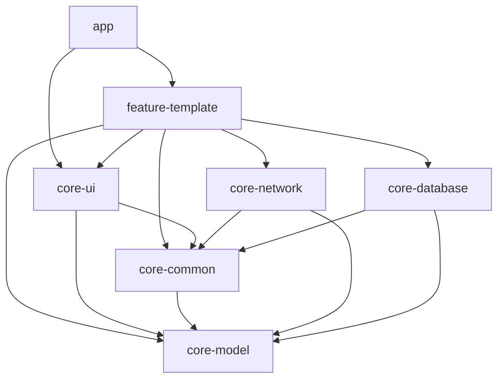

# Android通用框架开发任务清单

## 📋 项目概述

构建生产级Android通用开发框架，采用MVVM + Clean Architecture，支持快速开发企业级应用。

------

## 🎯 阶段一：架构设计（优先完成）

### 1.1 整体架构设计

-  绘制模块依赖关系图（Mermaid）
-  说明技术选型理由
-  定义完整目录结构
-  设计Gradle配置策略

### 1.2 技术栈确认

-  Kotlin 100%覆盖
-  MVVM + Clean Architecture模式
-  Kotlin Flow替代LiveData
-  Hilt依赖注入
-  Retrofit + OkHttp网络层
-  Room数据库 + KSP
-  Coroutines异步处理
-  ViewBinding视图绑定
-  SDK版本：最低API 24，目标API 36
-  Gradle Version Catalog依赖管理

### 1.3 项目配置说明

-  **项目名称**：Atlas
-  **根包名**：`com.sword.atlas`
-  **模块包名规范**：
   -  核心模块：`com.sword.atlas.core.{module}`
   -  功能模块：`com.sword.atlas.feature.{feature}`
   -  应用模块：`com.sword.atlas`
-  **编译配置**：
   -  compileSdk = 36
   -  targetSdk = 36
   -  minSdk = 24
   -  jvmTarget = "11"

### 1.4 模块依赖关系



**依赖层级说明：**
- **app**：主应用模块，依赖所有功能模块
- **feature-***：功能模块，可依赖所有core模块，禁止相互依赖
- **core-ui**：UI组件，依赖core-common和core-model
- **core-network/database**：数据层，依赖core-common和core-model
- **core-common**：基础工具，依赖core-model
- **core-model**：数据模型，最底层，不依赖任何业务模块

------

## 🏗️ 阶段二：核心模块实现

### 2.1 Gradle配置（依赖版本管理）

**优先级：🔴 最高**

-  扩展`gradle/libs.versions.toml`
  -  添加Hilt版本
  -  添加Retrofit/OkHttp版本
  -  添加Room版本
  -  添加Coroutines版本
  -  添加其他必要库版本

-  配置根目录`build.gradle.kts`
  -  添加Hilt插件（apply false）
  -  添加KSP插件（apply false）
  -  添加Android Library插件（apply false）

-  更新`settings.gradle.kts`
  -  添加所有模块的include声明
  -  配置模块依赖关系

-  创建`gradle/plugins.gradle.kts`（可选）
  -  定义通用插件配置

**交付物：**

```
gradle/
├── libs.versions.toml（扩展）
└── wrapper/
    ├── gradle-wrapper.jar
    └── gradle-wrapper.properties

build.gradle.kts（更新）
```

------

### 2.2 core-model模块（数据模型）

**优先级：🔴 最高**

-  创建Android Library模块
-  基础模型类
  -  `ApiResponse<T>`：统一API响应包装
  -  `Result<T>`：业务结果封装
  -  `UiState<T>`：UI状态密封类（Loading/Success/Error）
  -  `PageData<T>`：分页数据模型
-  错误码枚举`ErrorCode`
-  创建`build.gradle.kts`
  -  应用`com.android.library`插件
  -  应用`kotlin-android`插件

**交付物：**

```
core-model/
├── build.gradle.kts
└── src/main/java/com/sword/atlas/core/model/
    ├── ApiResponse.kt
    ├── Result.kt
    ├── UiState.kt
    ├── PageData.kt
    └── ErrorCode.kt
```

------

### 2.3 core-network模块（网络层）

**优先级：🔴 最高**

-  Retrofit配置
  -  `RetrofitClient`单例
  -  支持多BaseUrl切换
  -  添加Gson转换器
-  OkHttp拦截器
  -  `LoggingInterceptor`：日志拦截
  -  `TokenInterceptor`：Token自动注入
  -  `SignInterceptor`：签名拦截器
-  Flow扩展函数
  -  `flowRequest{}`：统一网络请求包装
  -  全局错误处理
  -  自动转换`Result<T>`
-  下载上传工具
  -  `DownloadManager`：下载进度监听
  -  `UploadManager`：上传进度监听
-  Hilt注入配置
  -  `NetworkModule`

**交付物：**


```
core-network/
├── build.gradle.kts
└── src/main/java/com/sword/atlas/core/network/
    ├── RetrofitClient.kt
    ├── interceptor/
    │   ├── LoggingInterceptor.kt
    │   ├── TokenInterceptor.kt
    │   └── SignInterceptor.kt
    ├── extension/
    │   └── FlowExt.kt
    ├── download/
    │   └── DownloadManager.kt
    ├── upload/
    │   └── UploadManager.kt
    └── di/
        └── NetworkModule.kt
```

------

### 2.4 core-database模块（数据库层）

**优先级：🟡 高**

-  Room配置（使用KSP）
  -  `AppDatabase`抽象类
  -  数据库版本管理
  -  迁移策略`MIGRATION_1_2`
-  BaseDao
  -  通用CRUD操作
  -  Flow响应式查询
-  实体示例
  -  `UserEntity`示例实体
-  Hilt注入配置
  -  `DatabaseModule`
-  build.gradle.kts配置
  -  应用KSP插件
  -  添加Room依赖

**交付物：**

```
core-database/
├── build.gradle.kts
└── src/main/java/com/sword/atlas/core/database/
    ├── AppDatabase.kt
    ├── BaseDao.kt
    ├── entity/
    │   └── UserEntity.kt
    ├── dao/
    │   └── UserDao.kt
    └── di/
        └── DatabaseModule.kt
```

------

### 2.5 core-common模块（基础架构）

**优先级：🔴 最高**

-  基础架构类
  -  `BaseViewModel`：统一状态管理
  -  `BaseRepository`：数据仓库模板
-  Kotlin扩展函数
  -  `StringExt.kt`：字符串扩展
  -  `ContextExt.kt`：Context扩展
  -  `ViewExt.kt`：View扩展
  -  `FlowExt.kt`：Flow扩展（状态收集、错误处理）
-  通用工具类
  -  `LogUtil`：日志工具（支持开发/生产环境切换）
  -  `SPUtil`：SharedPreferences封装
  -  `JsonUtil`：JSON解析工具（Gson封装）
  -  `ToastUtil`：Toast工具
  -  `DateUtil`：日期工具
  -  `NetworkUtil`：网络状态检测
-  协程和异常处理
  -  `DispatcherProvider`：协程调度器提供者
  -  `ExceptionHandler`：全局异常处理
  -  `ErrorMapper`：错误映射工具
-  常量定义
  -  `AppConstants`：应用常量

**交付物：**


```
core-common/
├── build.gradle.kts
└── src/main/java/com/sword/atlas/core/common/
    ├── base/
    │   ├── BaseViewModel.kt
    │   └── BaseRepository.kt
    ├── extension/
    │   ├── StringExt.kt
    │   ├── ContextExt.kt
    │   ├── ViewExt.kt
    │   └── FlowExt.kt
    ├── util/
    │   ├── LogUtil.kt
    │   ├── SPUtil.kt
    │   ├── JsonUtil.kt
    │   ├── ToastUtil.kt
    │   ├── DateUtil.kt
    │   └── NetworkUtil.kt
    ├── coroutine/
    │   ├── DispatcherProvider.kt
    │   ├── ExceptionHandler.kt
    │   └── ErrorMapper.kt
    └── constant/
        └── AppConstants.kt
```

------

### 2.6 core-ui模块（UI组件）

**优先级：🟡 高**

-  基础Activity/Fragment
  -  `BaseActivity`：通用Activity基类
  -  `BaseFragment`：通用Fragment基类
  -  `BaseVMActivity`：带ViewModel的Activity（支持Hilt）
  -  `BaseVMFragment`：带ViewModel的Fragment（支持Hilt）
-  通用Dialog
  -  `LoadingDialog`：加载对话框
  -  `CommonDialog`：通用对话框
-  通用状态View
  -  `EmptyView`：空数据视图
  -  `ErrorView`：错误视图
  -  `StateLayout`：状态布局容器
-  RecyclerView组件
  -  `BaseAdapter`：通用Adapter
  -  `BaseViewHolder`：通用ViewHolder
  -  `MultiTypeAdapter`：多类型Adapter
-  自定义控件
  -  `TitleBar`：标题栏
  -  `LoadingButton`：带加载状态按钮
-  布局文件
  -  对应XML布局资源
-  ViewBinding配置
  -  启用ViewBinding
  -  创建ViewBinding扩展函数

**交付物：**


```
core-ui/
├── build.gradle.kts
└── src/main/
    ├── java/com/sword/atlas/core/ui/
    │   ├── base/
    │   │   ├── BaseActivity.kt
    │   │   ├── BaseFragment.kt
    │   │   ├── BaseVMActivity.kt
    │   │   └── BaseVMFragment.kt
    │   ├── dialog/
    │   │   ├── LoadingDialog.kt
    │   │   └── CommonDialog.kt
    │   ├── widget/
    │   │   ├── EmptyView.kt
    │   │   ├── ErrorView.kt
    │   │   ├── StateLayout.kt
    │   │   ├── TitleBar.kt
    │   │   └── LoadingButton.kt
    │   ├── adapter/
    │   │   ├── BaseAdapter.kt
    │   │   ├── BaseViewHolder.kt
    │   │   └── MultiTypeAdapter.kt
    │   └── extension/
    │       └── ViewBindingExt.kt
    └── res/
        ├── layout/
        │   ├── layout_loading_dialog.xml
        │   ├── layout_common_dialog.xml
        │   ├── layout_empty_view.xml
        │   ├── layout_error_view.xml
        │   └── layout_title_bar.xml
        ├── values/
        │   ├── colors.xml
        │   ├── dimens.xml
        │   └── strings.xml
        └── drawable/
            └── [相关drawable资源]
```

------

### 2.7 feature-template模块（功能模板）

**优先级：🟢 中**

-  完整登录功能示例
  -  `LoginActivity`：登录界面
  -  `LoginViewModel`：登录逻辑
  -  `LoginRepository`：登录数据仓库
  -  `LoginApi`：登录API接口
  -  `LoginRequest/Response`：请求响应模型
  -  布局文件
-  列表功能示例
  -  `UserListFragment`：用户列表
  -  `UserListViewModel`
  -  支持分页加载
  -  支持下拉刷新
-  详情功能示例
  -  `UserDetailActivity`
  -  `UserDetailViewModel`

**交付物：**


```
feature-template/
├── build.gradle.kts
└── src/main/
    ├── java/com/sword/atlas/feature/template/
    │   ├── login/
    │   │   ├── LoginActivity.kt
    │   │   ├── LoginViewModel.kt
    │   │   ├── LoginRepository.kt
    │   │   ├── LoginApi.kt
    │   │   └── model/
    │   │       ├── LoginRequest.kt
    │   │       └── LoginResponse.kt
    │   ├── list/
    │   │   ├── UserListFragment.kt
    │   │   ├── UserListViewModel.kt
    │   │   ├── UserListRepository.kt
    │   │   └── adapter/
    │   │       └── UserListAdapter.kt
    │   └── detail/
    │       ├── UserDetailActivity.kt
    │       └── UserDetailViewModel.kt
    └── res/
        └── layout/
            ├── activity_login.xml
            ├── fragment_user_list.xml
            ├── activity_user_detail.xml
            └── item_user.xml
```

------

### 2.8 app模块（主应用）

**优先级：🟢 中**

-  Application配置
  -  `App`类：Application初始化
  -  `@HiltAndroidApp`注解
  -  全局配置初始化（日志、崩溃收集等）
-  MainActivity示例
  -  `@AndroidEntryPoint`注解
  -  导航到功能模块
  -  演示框架使用
-  AndroidManifest配置
  -  权限声明（网络、存储等）
  -  Application配置
  -  Activity注册
-  build.gradle.kts
  -  应用Hilt插件
  -  依赖所有core和feature模块
  -  配置签名
  -  配置ProGuard/R8规则
  -  启用ViewBinding

**交付物：**

```
app/
├── build.gradle.kts
├── proguard-rules.pro
└── src/main/
    ├── java/com/sword/atlas/
    │   ├── App.kt
    │   └── MainActivity.kt
    ├── res/
    │   ├── layout/
    │   │   └── activity_main.xml
    │   ├── values/
    │   │   ├── strings.xml
    │   │   ├── colors.xml
    │   │   └── themes.xml
    │   └── mipmap/
    │       └── [应用图标]
    └── AndroidManifest.xml
```

------

### 2.9 混淆配置模块

**优先级：🟢 中**

-  应用模块混淆规则（proguard-rules.pro）
  -  基础混淆配置
  -  保留反射使用的类
  -  保留序列化类
-  各模块consumer-rules.pro
  -  core-model：保留数据模型
  -  core-network：保留Retrofit接口和模型
  -  core-database：保留Room实体
-  第三方库混淆规则
  -  Retrofit/OkHttp
  -  Gson
  -  Room
  -  Hilt
-  R8优化配置
  -  代码优化
  -  资源优化

**交付物：**

```
app/proguard-rules.pro
core-model/consumer-rules.pro
core-network/consumer-rules.pro
core-database/consumer-rules.pro
```

------

## 📚 阶段三：文档编写

### 3.1 README.md

-  项目介绍
-  技术栈说明
-  快速开始指南
-  模块说明
-  使用示例
-  贡献指南

### 3.2 开发文档

-  架构设计文档
-  编码规范文档
-  模块开发指南
-  API文档

------

## ✅ 阶段四：验收测试

### 4.1 编译验证

-  Gradle同步成功
-  无循环依赖警告
-  所有模块编译通过
-  APK打包成功

### 4.2 功能验证

-  登录模块功能正常
-  列表模块功能正常
-  网络请求正常
-  数据库操作正常
-  状态管理正常

### 4.3 代码质量检查

-  Lint检查通过
-  无内存泄漏
-  无硬编码
-  注释完整
-  命名规范

### 4.4 性能测试

-  冷启动时间 < 2s
-  内存占用合理
-  无ANR问题
-  网络请求响应正常

### 4.5 单元测试（可选）

-  测试框架：JUnit 5 + Mockk + Turbine
-  Repository层单元测试
-  ViewModel层单元测试
-  工具类单元测试
-  Flow测试（使用Turbine）
-  目标覆盖率：核心模块 > 60%

------

## 📊 进度跟踪

| 模块 | 状态 | 完成度 | 备注 |
|------|------|--------|------|
| 1. 架构设计 | ⏳ 待开始 | 0% | 模块依赖图、技术栈确认 |
| 2.1 Gradle配置 | ⏳ 待开始 | 0% | Version Catalog配置 |
| 2.2 core-model | ⏳ 待开始 | 0% | 基础数据模型 |
| 2.3 core-network | ⏳ 待开始 | 0% | Retrofit + OkHttp |
| 2.4 core-database | ⏳ 待开始 | 0% | Room + KSP |
| 2.5 core-common | ⏳ 待开始 | 0% | 基础工具、协程配置 |
| 2.6 core-ui | ⏳ 待开始 | 0% | ViewBinding + 基础组件 |
| 2.7 feature-template | ⏳ 待开始 | 0% | 登录/列表/详情示例 |
| 2.8 app | ⏳ 待开始 | 0% | Hilt集成 |
| 2.9 混淆配置 | ⏳ 待开始 | 0% | ProGuard/R8 |
| 3. 文档编写 | ⏳ 待开始 | 0% | README + 开发文档 |
| 4. 测试验收 | ⏳ 待开始 | 0% | 编译、功能、性能测试 |

**状态说明：**

- ⏳ 待开始
- 🚧 进行中
- ✅ 已完成
- ❌ 有问题

------

## 🎯 里程碑

1. M1 - 架构设计完成

   （预计1天）

   - 完成架构图和技术选型文档

2. M2 - 核心模块完成

   （预计3天）

   - Gradle配置、core-model、core-network、core-common完成

3. M3 - UI层完成

   （预计2天）

   - core-ui、core-database完成

4. M4 - 功能模板完成

   （预计2天）

   - feature-template完整示例实现

5. M5 - 集成验收

   （预计1天）

   - app模块集成、测试、文档完成

**总预计工期：9天**

------

## 📝 注意事项

1. **严格遵守模块依赖规则**
   - feature模块禁止互相依赖
   - 避免循环依赖
   - core模块之间可适当依赖，但需注意层次关系

2. **代码质量要求**
   - 100% Kotlin
   - 完整KDoc注释
   - 符合命名规范
   - 所有类必须有明确的职责

3. **禁止事项**
   - ❌ 使用LiveData（统一使用Flow）
   - ❌ 使用RxJava
   - ❌ 硬编码字符串、颜色、尺寸
   - ❌ 主线程耗时操作
   - ❌ 使用KAPT（优先使用KSP）

4. **安全规范**
   - 正确使用空安全操作符（`?.`, `?:`, `!!`谨慎使用）
   - 处理协程取消异常（CancellationException）
   - 避免内存泄漏（正确管理生命周期）
   - ViewModel中使用`viewModelScope`
   - Fragment中使用`viewLifecycleOwner`

5. **Hilt注解规范**
   - Application使用`@HiltAndroidApp`
   - Activity/Fragment使用`@AndroidEntryPoint`
   - ViewModel使用`@HiltViewModel`并注入`@Inject constructor`
   - Module使用`@Module`和`@InstallIn`

6. **ViewBinding使用规范**
   - 所有Activity/Fragment启用ViewBinding
   - 使用扩展函数简化ViewBinding初始化
   - 正确处理Fragment的ViewBinding生命周期

------

## 🚀 快速启动检查清单

框架完成后，新功能模块应能在10分钟内创建：

-  复制feature-template模块
-  修改模块名称
-  修改包名
-  实现业务逻辑
-  在app模块添加依赖
-  运行测试

------

## 📦 推荐依赖版本参考

| 依赖库 | 版本 | 说明 |
|-------|------|------|
| Kotlin | 2.0.21 | Kotlin语言版本 |
| AGP | 8.10.1 | Android Gradle Plugin |
| Hilt | 2.51 | 依赖注入框架 |
| KSP | 2.0.21-1.0.28 | Kotlin符号处理器 |
| Retrofit | 2.11.0 | 网络请求库 |
| OkHttp | 4.12.0 | HTTP客户端 |
| Gson | 2.11.0 | JSON解析 |
| Room | 2.6.1 | 数据库 |
| Coroutines | 1.9.0 | 协程库 |
| Lifecycle | 2.8.7 | 生命周期组件 |
| Navigation | 2.8.5 | 导航组件（可选） |
| Coil | 2.7.0 | 图片加载（可选） |
| Timber | 5.0.1 | 日志库（可选） |

**注意**：具体版本号应在`gradle/libs.versions.toml`中统一管理

------

**文档版本：** v2.0
 **创建日期：** 2025-10-09
 **最后更新：** 2025-10-09
 **更新内容：** 
 - 移除buildSrc，改用Version Catalog
 - 统一包名为com.sword.atlas
 - 添加模块依赖关系图
 - 增加ViewBinding和KSP配置说明
 - 完善Hilt注解使用规范
 - 添加协程和错误处理配置
 - 增加混淆配置模块
 - 添加推荐依赖版本表