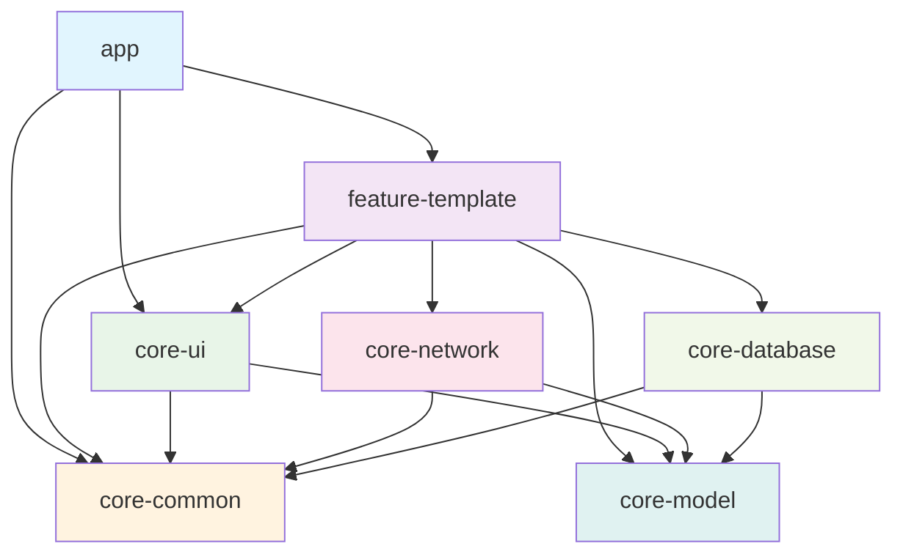

# Atlas Android Framework 架构设计文档

## 1. 概述

Atlas Android Framework 是一个基于 MVVM + Clean Architecture 的现代化 Android 开发框架，旨在提供高效、可维护、可扩展的企业级应用开发解决方案。

### 1.1 设计目标

- **模块化**：清晰的模块边界，支持独立开发和测试
- **可扩展性**：支持快速添加新功能模块
- **可维护性**：代码结构清晰，易于理解和修改
- **高性能**：优化构建速度和运行性能
- **类型安全**：充分利用 Kotlin 的类型系统

### 1.2 核心原则

- **单一职责原则**：每个模块和类都有明确的职责
- **依赖倒置原则**：高层模块不依赖低层模块，都依赖抽象
- **开闭原则**：对扩展开放，对修改关闭
- **接口隔离原则**：使用多个专门的接口，而不是单一的总接口

## 2. 整体架构

### 2.1 架构模式

采用 **MVVM (Model-View-ViewModel) + Clean Architecture** 混合架构：

```
┌─────────────────────────────────────────────────────────────┐
│                    Presentation Layer                       │
│  ┌─────────────┐  ┌─────────────┐  ┌─────────────────────┐  │
│  │   Activity  │  │  Fragment   │  │      ViewModel      │  │
│  │   Dialog    │  │   Adapter   │  │    (UI Logic)       │  │
│  └─────────────┘  └─────────────┘  └─────────────────────┘  │
└─────────────────────────────────────────────────────────────┘
                              │
                              ▼
┌─────────────────────────────────────────────────────────────┐
│                     Domain Layer                            │
│  ┌─────────────┐  ┌─────────────┐  ┌─────────────────────┐  │
│  │   UseCase   │  │   Entity    │  │     Repository      │  │
│  │ (Business)  │  │  (Models)   │  │    (Interface)      │  │
│  └─────────────┘  └─────────────┘  └─────────────────────┘  │
└─────────────────────────────────────────────────────────────┘
                              │
                              ▼
┌─────────────────────────────────────────────────────────────┐
│                      Data Layer                             │
│  ┌─────────────┐  ┌─────────────┐  ┌─────────────────────┐  │
│  │ Repository  │  │  DataSource │  │       API/DB        │  │
│  │    Impl     │  │ (Remote/    │  │    (External)       │  │
│  │             │  │  Local)     │  │                     │  │
│  └─────────────┘  └─────────────┘  └─────────────────────┘  │
└─────────────────────────────────────────────────────────────┘
```

### 2.2 模块依赖关系图



## 3. 技术选型理由

### 3.1 开发语言
- **Kotlin 2.0.21**：现代化语言特性，空安全，协程支持
- **Java 17**：长期支持版本，性能优化

### 3.2 架构组件
- **Hilt 2.51**：编译时依赖注入，性能优于运行时注入
- **Lifecycle 2.8.7**：官方生命周期管理，与系统深度集成
- **ViewModel 2.8.7**：配置变更时数据保持，UI逻辑分离
- **Coroutines 1.9.0**：结构化并发，替代传统异步方案

### 3.3 网络层
- **Retrofit 2.11.0**：类型安全的HTTP客户端，注解驱动
- **OkHttp 4.12.0**：高性能HTTP客户端，连接池优化
- **Gson 2.11.0**：JSON序列化，性能稳定

### 3.4 数据库层
- **Room 2.6.1**：SQLite抽象层，编译时SQL验证
- **KSP 2.0.21-1.0.28**：Kotlin符号处理，替代KAPT提升编译速度
## 
4. 完整目录结构

```
Atlas/
├── app/                                    # 主应用模块
│   ├── src/
│   │   ├── main/
│   │   │   ├── java/com/sword/atlas/
│   │   │   │   ├── App.kt                  # Application类
│   │   │   │   ├── MainActivity.kt         # 主Activity
│   │   │   │   └── di/                     # Hilt模块
│   │   │   │       └── AppModule.kt
│   │   │   ├── res/
│   │   │   │   ├── layout/
│   │   │   │   │   └── activity_main.xml
│   │   │   │   ├── values/
│   │   │   │   │   ├── colors.xml
│   │   │   │   │   ├── strings.xml
│   │   │   │   │   └── themes.xml
│   │   │   │   └── values-night/
│   │   │   │       └── colors.xml
│   │   │   └── AndroidManifest.xml
│   │   ├── debug/                          # Debug配置
│   │   └── release/                        # Release配置
│   ├── build.gradle.kts
│   └── proguard-rules.pro
│
├── feature-template/                       # 功能模板模块
│   ├── src/main/java/com/sword/atlas/feature/template/
│   │   ├── data/                          # 数据层
│   │   │   ├── api/
│   │   │   │   ├── LoginApi.kt            # API接口定义
│   │   │   │   └── UserApi.kt
│   │   │   ├── model/                     # 数据模型
│   │   │   │   ├── LoginRequest.kt
│   │   │   │   ├── LoginResponse.kt
│   │   │   │   └── UserDto.kt
│   │   │   └── repository/                # 仓库实现
│   │   │       ├── LoginRepository.kt
│   │   │       └── UserRepository.kt
│   │   ├── domain/                        # 领域层（可选）
│   │   │   ├── usecase/
│   │   │   └── model/
│   │   ├── ui/                           # UI层
│   │   │   ├── login/                    # 登录功能
│   │   │   │   ├── LoginActivity.kt
│   │   │   │   └── LoginViewModel.kt
│   │   │   ├── userlist/                 # 用户列表
│   │   │   │   ├── UserListFragment.kt
│   │   │   │   ├── UserListViewModel.kt
│   │   │   │   └── UserListAdapter.kt
│   │   │   └── userdetail/               # 用户详情
│   │   │       ├── UserDetailActivity.kt
│   │   │       └── UserDetailViewModel.kt
│   │   └── di/                           # 依赖注入
│   │       └── FeatureModule.kt
│   ├── src/main/res/
│   │   ├── layout/
│   │   │   ├── activity_login.xml
│   │   │   ├── activity_user_detail.xml
│   │   │   ├── fragment_user_list.xml
│   │   │   └── item_user.xml
│   │   └── values/
│   │       └── strings.xml
│   └── build.gradle.kts
│
├── core-ui/                               # UI组件模块
│   ├── src/main/java/com/sword/atlas/core/ui/
│   │   ├── base/                         # 基础类
│   │   │   ├── BaseActivity.kt
│   │   │   ├── BaseVMActivity.kt
│   │   │   ├── BaseFragment.kt
│   │   │   └── BaseVMFragment.kt
│   │   ├── adapter/                      # 适配器
│   │   │   ├── BaseAdapter.kt
│   │   │   ├── MultiTypeAdapter.kt
│   │   │   └── BaseViewHolder.kt
│   │   ├── dialog/                       # 对话框
│   │   │   ├── CommonDialog.kt
│   │   │   ├── LoadingDialog.kt
│   │   │   └── ConfirmDialog.kt
│   │   ├── widget/                       # 自定义控件
│   │   │   ├── TitleBar.kt
│   │   │   ├── LoadingButton.kt
│   │   │   ├── StateLayout.kt
│   │   │   └── EmptyView.kt
│   │   └── ext/                          # UI扩展函数
│   │       ├── ViewExt.kt
│   │       └── ActivityExt.kt
│   ├── src/main/res/
│   │   ├── layout/
│   │   │   ├── layout_title_bar.xml
│   │   │   └── layout_empty_view.xml
│   │   ├── drawable/
│   │   │   └── bg_card.xml
│   │   └── values/
│   │       └── attrs.xml
│   └── build.gradle.kts
│
├── core-common/                          # 基础架构模块
│   ├── src/main/java/com/sword/atlas/core/common/
│   │   ├── base/                        # 基础类
│   │   │   ├── BaseRepository.kt
│   │   │   ├── BaseViewModel.kt
│   │   │   └── BaseUseCase.kt
│   │   ├── util/                        # 工具类
│   │   │   ├── LogUtil.kt
│   │   │   ├── NetworkUtil.kt
│   │   │   ├── DateUtil.kt
│   │   │   └── FileUtil.kt
│   │   ├── ext/                         # 扩展函数
│   │   │   ├── StringExt.kt
│   │   │   ├── ContextExt.kt
│   │   │   ├── FlowExt.kt
│   │   │   └── CollectionExt.kt
│   │   ├── constant/                    # 常量定义
│   │   │   ├── AppConstants.kt
│   │   │   └── HttpConstants.kt
│   │   └── exception/                   # 异常处理
│   │       ├── AppException.kt
│   │       └── ErrorHandler.kt
│   └── build.gradle.kts
│
├── core-network/                         # 网络层模块
│   ├── src/main/java/com/sword/atlas/core/network/
│   │   ├── client/                      # 网络客户端
│   │   │   ├── RetrofitClient.kt
│   │   │   └── OkHttpClient.kt
│   │   ├── interceptor/                 # 拦截器
│   │   │   ├── LoggingInterceptor.kt
│   │   │   ├── HeaderInterceptor.kt
│   │   │   ├── SignInterceptor.kt
│   │   │   └── CacheInterceptor.kt
│   │   ├── manager/                     # 管理器
│   │   │   ├── DownloadManager.kt
│   │   │   └── UploadManager.kt
│   │   ├── ext/                         # 扩展函数
│   │   │   └── FlowRequestExt.kt
│   │   └── di/                          # 依赖注入
│   │       └── NetworkModule.kt
│   └── build.gradle.kts
│
├── core-database/                        # 数据库层模块
│   ├── src/main/java/com/sword/atlas/core/database/
│   │   ├── dao/                         # DAO接口
│   │   │   ├── BaseDao.kt
│   │   │   └── UserDao.kt
│   │   ├── entity/                      # 实体类
│   │   │   └── UserEntity.kt
│   │   ├── database/                    # 数据库
│   │   │   └── AppDatabase.kt
│   │   ├── migration/                   # 数据库迁移
│   │   │   └── DatabaseMigrations.kt
│   │   └── di/                          # 依赖注入
│   │       └── DatabaseModule.kt
│   ├── consumer-rules.pro
│   ├── proguard-rules.pro
│   └── build.gradle.kts
│
├── core-model/                           # 数据模型模块
│   ├── src/main/java/com/sword/atlas/core/model/
│   │   ├── ApiResponse.kt               # API响应包装
│   │   ├── DataResult.kt                    # 结果包装
│   │   ├── UiState.kt                   # UI状态
│   │   ├── PageData.kt                  # 分页数据
│   │   ├── ErrorCode.kt                 # 错误码定义
│   │   └── User.kt                      # 用户模型
│   └── build.gradle.kts
│
├── gradle/                               # Gradle配置
│   ├── libs.versions.toml               # 版本目录
│   └── wrapper/
│       ├── gradle-wrapper.jar
│       └── gradle-wrapper.properties
│
├── doc/                                  # 文档目录
│   ├── 架构设计文档.md
│   ├── 编码规范文档.md
│   ├── 模块开发指南.md
│   ├── API使用文档.md
│   └── 混淆配置说明.md
│
├── build.gradle.kts                      # 根构建脚本
├── settings.gradle.kts                   # 项目设置
├── gradle.properties                     # Gradle属性
├── README.md                            # 项目说明
└── LICENSE                              # 许可证
```

## 5. Gradle配置策略

### 5.1 版本目录管理 (libs.versions.toml)

采用 Gradle Version Catalog 统一管理依赖版本：

```toml
[versions]
# Kotlin & Android
kotlin = "2.0.21"
agp = "8.10.1"
compileSdk = "36"
minSdk = "24"
targetSdk = "36"

# AndroidX
lifecycle = "2.8.7"
hilt = "2.51"
room = "2.6.1"

# Network
retrofit = "2.11.0"
okhttp = "4.12.0"
gson = "2.11.0"

# UI
material = "1.13.0"
constraintlayout = "2.2.1"

[libraries]
# Kotlin
kotlin-stdlib = { group = "org.jetbrains.kotlin", name = "kotlin-stdlib", version.ref = "kotlin" }
kotlinx-coroutines-android = { group = "org.jetbrains.kotlinx", name = "kotlinx-coroutines-android", version = "1.9.0" }

# AndroidX
androidx-core-ktx = { group = "androidx.core", name = "core-ktx", version = "1.15.0" }
androidx-lifecycle-viewmodel-ktx = { group = "androidx.lifecycle", name = "lifecycle-viewmodel-ktx", version.ref = "lifecycle" }

[plugins]
android-application = { id = "com.android.application", version.ref = "agp" }
android-library = { id = "com.android.library", version.ref = "agp" }
kotlin-android = { id = "org.jetbrains.kotlin.android", version.ref = "kotlin" }
hilt = { id = "com.google.dagger.hilt.android", version.ref = "hilt" }
```

### 5.2 模块构建配置

#### 5.2.1 应用模块 (app/build.gradle.kts)
```kotlin
plugins {
    alias(libs.plugins.android.application)
    alias(libs.plugins.kotlin.android)
    alias(libs.plugins.hilt)
    kotlin("kapt")
}

android {
    namespace = "com.sword.atlas"
    compileSdk = libs.versions.compileSdk.get().toInt()
    
    defaultConfig {
        applicationId = "com.sword.atlas"
        minSdk = libs.versions.minSdk.get().toInt()
        targetSdk = libs.versions.targetSdk.get().toInt()
        versionCode = 1
        versionName = "1.0.0"
    }
    
    buildTypes {
        debug {
            isMinifyEnabled = false
            applicationIdSuffix = ".debug"
        }
        release {
            isMinifyEnabled = true
            proguardFiles(getDefaultProguardFile("proguard-android-optimize.txt"), "proguard-rules.pro")
        }
    }
    
    buildFeatures {
        viewBinding = true
    }
}

dependencies {
    implementation(project(":feature-template"))
    implementation(project(":core-ui"))
    implementation(project(":core-common"))
    
    implementation(libs.androidx.core.ktx)
    implementation(libs.androidx.lifecycle.viewmodel.ktx)
    implementation(libs.hilt.android)
    kapt(libs.hilt.compiler)
}
```

#### 5.2.2 功能模块 (feature-template/build.gradle.kts)
```kotlin
plugins {
    alias(libs.plugins.android.library)
    alias(libs.plugins.kotlin.android)
    alias(libs.plugins.hilt)
    kotlin("kapt")
}

android {
    namespace = "com.sword.atlas.feature.template"
    compileSdk = libs.versions.compileSdk.get().toInt()
    
    defaultConfig {
        minSdk = libs.versions.minSdk.get().toInt()
    }
    
    buildFeatures {
        viewBinding = true
    }
}

dependencies {
    implementation(project(":core-ui"))
    implementation(project(":core-network"))
    implementation(project(":core-database"))
    implementation(project(":core-model"))
    implementation(project(":core-common"))
    
    implementation(libs.androidx.lifecycle.viewmodel.ktx)
    implementation(libs.hilt.android)
    kapt(libs.hilt.compiler)
}
```

#### 5.2.3 核心模块配置模式
```kotlin
// 所有core-*模块的通用配置
plugins {
    alias(libs.plugins.android.library)
    alias(libs.plugins.kotlin.android)
}

android {
    namespace = "com.sword.atlas.core.{module_name}"
    compileSdk = libs.versions.compileSdk.get().toInt()
    
    defaultConfig {
        minSdk = libs.versions.minSdk.get().toInt()
        consumerProguardFiles("consumer-rules.pro")
    }
}
```### 5.
3 构建优化配置

#### 5.3.1 Gradle属性优化 (gradle.properties)
```properties
# Kotlin编译优化
kotlin.code.style=official
kotlin.incremental=true
kotlin.incremental.useClasspathSnapshot=true
kotlin.build.report.output=file

# Android构建优化
android.useAndroidX=true
android.enableJetifier=true
android.nonTransitiveRClass=true
android.nonFinalResIds=true

# 构建缓存
org.gradle.caching=true
org.gradle.parallel=true
org.gradle.configureondemand=true

# JVM优化
org.gradle.jvmargs=-Xmx4g -XX:+UseParallelGC -XX:+HeapDumpOnOutOfMemoryError -Dfile.encoding=UTF-8

# KSP优化
ksp.incremental=true
ksp.incremental.intermodule=true
```

#### 5.3.2 编译时间优化策略

1. **KSP替代KAPT**：Room和Hilt使用KSP，编译速度提升30-50%
2. **增量编译**：启用Kotlin增量编译和类路径快照
3. **并行构建**：启用Gradle并行构建和按需配置
4. **构建缓存**：启用本地和远程构建缓存
5. **资源优化**：使用非传递R类和非最终资源ID

#### 5.3.3 模块依赖优化

```kotlin
// 使用api()暴露传递依赖
dependencies {
    api(project(":core-model"))      // 数据模型需要传递
    implementation(project(":core-ui")) // UI组件不需要传递
}

// 避免循环依赖
// ✅ 正确：单向依赖
feature-template -> core-network -> core-model

// ❌ 错误：循环依赖
feature-template <-> core-network
```

## 6. 模块设计详解

### 6.1 应用模块 (app)

**职责**：应用入口，模块集成，全局配置

**核心组件**：
- `App.kt`：Application类，全局初始化
- `MainActivity.kt`：主Activity，导航入口
- `AppModule.kt`：应用级Hilt模块

**依赖关系**：
- 依赖所有feature模块
- 依赖core-ui（主题、通用组件）
- 依赖core-common（全局工具）

### 6.2 功能模块 (feature-*)

**职责**：具体业务功能实现

**分层结构**：
```
feature-template/
├── data/           # 数据层
│   ├── api/        # 网络接口
│   ├── model/      # 数据传输对象
│   └── repository/ # 数据仓库实现
├── domain/         # 领域层（可选）
│   ├── usecase/    # 业务用例
│   └── model/      # 领域模型
├── ui/             # 表现层
│   ├── activity/   # Activity
│   ├── fragment/   # Fragment
│   ├── viewmodel/  # ViewModel
│   └── adapter/    # 适配器
└── di/             # 依赖注入
```

**设计原则**：
- 每个功能模块独立，可单独编译测试
- 通过Repository模式隔离数据源
- 使用ViewModel管理UI状态
- 通过Hilt进行依赖注入

### 6.3 UI组件模块 (core-ui)

**职责**：通用UI组件，基础Activity/Fragment

**核心组件**：
- **基础类**：BaseActivity、BaseFragment、BaseViewModel
- **自定义控件**：TitleBar、LoadingButton、StateLayout
- **适配器**：BaseAdapter、MultiTypeAdapter
- **对话框**：CommonDialog、LoadingDialog
- **扩展函数**：View扩展、Activity扩展

**设计特点**：
- 提供MVVM基础架构
- 统一UI风格和交互
- 支持主题切换
- 提供常用UI组件

### 6.4 网络模块 (core-network)

**职责**：网络请求，API管理，数据转换

**核心组件**：
- **客户端**：RetrofitClient、OkHttpClient配置
- **拦截器**：日志、请求头、签名、缓存
- **管理器**：下载管理、上传管理
- **扩展函数**：Flow请求扩展

**技术实现**：
```kotlin
// 统一的API响应处理
suspend fun <T> executeRequest(
    request: suspend () -> ApiResponse<T>
): DataResult<T> {
    return try {
        val response = request()
        if (response.isSuccess()) {
            DataResult.Success(response.data)
        } else {
            DataResult.Error(response.code, response.message)
        }
    } catch (e: Exception) {
        DataResult.Error(ErrorCode.NETWORK_ERROR, e.message ?: "网络错误")
    }
}
```

### 6.5 数据库模块 (core-database)

**职责**：本地数据存储，数据库操作

**核心组件**：
- **数据库**：AppDatabase（Room数据库）
- **DAO**：BaseDao、具体DAO接口
- **实体**：数据库实体类
- **迁移**：数据库版本迁移

**设计模式**：
```kotlin
// 基础DAO接口
@Dao
interface BaseDao<T> {
    @Insert(onConflict = OnConflictStrategy.REPLACE)
    suspend fun insert(entity: T): Long
    
    @Insert(onConflict = OnConflictStrategy.REPLACE)
    suspend fun insertAll(entities: List<T>): List<Long>
    
    @Update
    suspend fun update(entity: T): Int
    
    @Delete
    suspend fun delete(entity: T): Int
}
```

### 6.6 通用模块 (core-common)

**职责**：基础工具，扩展函数，常量定义

**核心组件**：
- **基础类**：BaseRepository、BaseViewModel
- **工具类**：日志、网络、日期、文件工具
- **扩展函数**：String、Context、Flow、Collection扩展
- **常量**：应用常量、HTTP常量
- **异常处理**：统一异常处理机制

### 6.7 数据模型模块 (core-model)

**职责**：数据模型定义，类型安全

**核心模型**：
```kotlin
// API响应包装
data class ApiResponse<T>(
    val code: Int,
    val message: String,
    val data: T?
) {
    fun isSuccess(): Boolean = code == 200
}

// 结果包装
sealed class DataResult<out T> {
    data class Success<T>(val data: T) : DataResult<T>()
    data class Error(val code: Int, val message: String) : DataResult<Nothing>()
}

// UI状态
sealed class UiState<out T> {
    object Idle : UiState<Nothing>()
    object Loading : UiState<Nothing>()
    data class Success<T>(val data: T) : UiState<T>()
    data class Error(val code: Int, val message: String) : UiState<Nothing>()
}
```

## 7. 依赖注入架构

### 7.1 Hilt模块结构

```kotlin
// 应用级模块
@Module
@InstallIn(SingletonComponent::class)
object AppModule {
    
    @Provides
    @Singleton
    fun provideContext(@ApplicationContext context: Context): Context = context
}

// 网络模块
@Module
@InstallIn(SingletonComponent::class)
object NetworkModule {
    
    @Provides
    @Singleton
    fun provideOkHttpClient(): OkHttpClient { /* ... */ }
    
    @Provides
    @Singleton
    fun provideRetrofit(okHttpClient: OkHttpClient): Retrofit { /* ... */ }
}

// 数据库模块
@Module
@InstallIn(SingletonComponent::class)
object DatabaseModule {
    
    @Provides
    @Singleton
    fun provideAppDatabase(@ApplicationContext context: Context): AppDatabase { /* ... */ }
}
```

### 7.2 作用域管理

- **@Singleton**：应用级单例（Application生命周期）
- **@ActivityScoped**：Activity级作用域
- **@FragmentScoped**：Fragment级作用域
- **@ViewModelScoped**：ViewModel级作用域

## 8. 数据流架构

### 8.1 MVVM数据流

```
View (Activity/Fragment) 
    ↕ (观察LiveData/StateFlow)
ViewModel (UI逻辑，状态管理)
    ↕ (调用Repository)
Repository (数据仓库，缓存策略)
    ↕ (协调数据源)
DataSource (Remote API / Local Database)
```

### 8.2 响应式编程

使用Kotlin Flow实现响应式数据流：

```kotlin
class UserRepository @Inject constructor(
    private val api: UserApi,
    private val dao: UserDao
) {
    fun getUserFlow(userId: Long): Flow<Result<User>> = flow {
        emit(Result.Loading)
        
        // 先发射本地数据
        dao.getUserById(userId).firstOrNull()?.let { localUser ->
            emit(Result.Success(localUser.toUser()))
        }
        
        // 再请求网络数据
        try {
            val remoteUser = api.getUser(userId)
            dao.insertUser(remoteUser.toEntity())
            emit(Result.Success(remoteUser.toUser()))
        } catch (e: Exception) {
            emit(Result.Error(ErrorCode.NETWORK_ERROR, e.message ?: "网络错误"))
        }
    }.flowOn(Dispatchers.IO)
}
```## 9
. 错误处理机制

### 9.1 统一错误处理

```kotlin
// 错误码定义
object ErrorCode {
    const val SUCCESS = 200
    const val NETWORK_ERROR = -1
    const val SERVER_ERROR = 500
    const val UNAUTHORIZED = 401
    const val FORBIDDEN = 403
    const val NOT_FOUND = 404
}

// 异常处理器
class ErrorHandler @Inject constructor() {
    
    fun handleError(throwable: Throwable): Result.Error {
        return when (throwable) {
            is HttpException -> {
                when (throwable.code()) {
                    401 -> Result.Error(ErrorCode.UNAUTHORIZED, "登录已过期")
                    403 -> Result.Error(ErrorCode.FORBIDDEN, "权限不足")
                    404 -> Result.Error(ErrorCode.NOT_FOUND, "资源不存在")
                    500 -> Result.Error(ErrorCode.SERVER_ERROR, "服务器错误")
                    else -> Result.Error(throwable.code(), throwable.message())
                }
            }
            is IOException -> Result.Error(ErrorCode.NETWORK_ERROR, "网络连接失败")
            else -> Result.Error(ErrorCode.NETWORK_ERROR, throwable.message ?: "未知错误")
        }
    }
}
```

### 9.2 全局异常捕获

```kotlin
class App : Application() {
    
    override fun onCreate() {
        super.onCreate()
        
        // 设置全局异常处理器
        Thread.setDefaultUncaughtExceptionHandler { thread, exception ->
            LogUtil.e("UncaughtException", "Thread: ${thread.name}", exception)
            // 上报崩溃信息
            CrashReporter.report(exception)
        }
    }
}
```

## 10. 性能优化策略

### 10.1 编译性能优化

| 优化项 | 配置 | 效果 |
|--------|------|------|
| KSP替代KAPT | `kotlin("ksp")` | 编译速度提升30-50% |
| 增量编译 | `kotlin.incremental=true` | 避免全量编译 |
| 并行构建 | `org.gradle.parallel=true` | 多模块并行编译 |
| 构建缓存 | `org.gradle.caching=true` | 复用编译结果 |
| JVM优化 | `-Xmx4g -XX:+UseParallelGC` | 提升编译内存和GC |

### 10.2 运行时性能优化

#### 10.2.1 内存优化
- 使用ViewBinding替代findViewById
- 及时释放大对象引用
- 使用对象池复用频繁创建的对象
- 合理使用单例模式

#### 10.2.2 网络优化
- HTTP/2支持，连接复用
- GZIP压缩，减少传输数据
- 请求缓存，避免重复请求
- 连接池管理，复用连接

#### 10.2.3 数据库优化
- 使用索引加速查询
- 批量操作减少事务次数
- 异步操作避免阻塞UI
- 分页加载大数据集

### 10.3 启动优化

```kotlin
class App : Application() {
    
    override fun onCreate() {
        super.onCreate()
        
        // 延迟初始化非关键组件
        initCriticalComponents()
        
        // 异步初始化其他组件
        GlobalScope.launch(Dispatchers.IO) {
            initNonCriticalComponents()
        }
    }
    
    private fun initCriticalComponents() {
        // 关键组件：日志、崩溃上报、Hilt
        LogUtil.init(this)
        CrashReporter.init(this)
    }
    
    private fun initNonCriticalComponents() {
        // 非关键组件：图片加载、推送、统计
        ImageLoader.init(this)
        PushManager.init(this)
        Analytics.init(this)
    }
}
```

## 11. 测试策略

### 11.1 测试金字塔

```
        /\
       /  \
      /    \     E2E Tests (少量)
     /______\    UI自动化测试
    /        \
   /          \   Integration Tests (适量)
  /____________\  模块集成测试
 /              \
/________________\ Unit Tests (大量)
   单元测试
```

### 11.2 单元测试

```kotlin
@RunWith(MockitoJUnitRunner::class)
class UserRepositoryTest {
    
    @Mock
    private lateinit var api: UserApi
    
    @Mock
    private lateinit var dao: UserDao
    
    private lateinit var repository: UserRepository
    
    @Before
    fun setup() {
        repository = UserRepository(api, dao)
    }
    
    @Test
    fun `getUser should return cached data first`() = runTest {
        // Given
        val userId = 1L
        val cachedUser = UserEntity(userId, "cached_user", null)
        whenever(dao.getUserById(userId)).thenReturn(flowOf(cachedUser))
        
        // When
        val result = repository.getUser(userId).first()
        
        // Then
        assertTrue(result is Result.Success)
        assertEquals("cached_user", (result as Result.Success).data.username)
    }
}
```

### 11.3 集成测试

```kotlin
@HiltAndroidTest
@RunWith(AndroidJUnit4::class)
class UserListFragmentTest {
    
    @get:Rule
    var hiltRule = HiltAndroidRule(this)
    
    @Test
    fun testUserListDisplay() {
        // 启动Fragment
        launchFragmentInHiltContainer<UserListFragment>()
        
        // 验证UI显示
        onView(withId(R.id.recyclerView))
            .check(matches(isDisplayed()))
    }
}
```

## 12. 安全策略

### 12.1 网络安全

```kotlin
// SSL Pinning
class SSLPinningInterceptor : Interceptor {
    override fun intercept(chain: Interceptor.Chain): Response {
        val request = chain.request()
        
        // 验证证书指纹
        if (!verifyCertificate(request.url.host)) {
            throw SSLException("Certificate pinning failed")
        }
        
        return chain.proceed(request)
    }
}

// 请求签名
class SignInterceptor @Inject constructor() : Interceptor {
    override fun intercept(chain: Interceptor.Chain): Response {
        val original = chain.request()
        val signed = original.newBuilder()
            .addHeader("X-Signature", generateSignature(original))
            .addHeader("X-Timestamp", System.currentTimeMillis().toString())
            .build()
        
        return chain.proceed(signed)
    }
}
```

### 12.2 数据安全

```kotlin
// 敏感数据加密存储
class SecurePreferences @Inject constructor(
    @ApplicationContext private val context: Context
) {
    private val masterKey = MasterKey.Builder(context)
        .setKeyScheme(MasterKey.KeyScheme.AES256_GCM)
        .build()
    
    private val encryptedPrefs = EncryptedSharedPreferences.create(
        context,
        "secure_prefs",
        masterKey,
        EncryptedSharedPreferences.PrefKeyEncryptionScheme.AES256_SIV,
        EncryptedSharedPreferences.PrefValueEncryptionScheme.AES256_GCM
    )
    
    fun saveToken(token: String) {
        encryptedPrefs.edit().putString("auth_token", token).apply()
    }
}
```

### 12.3 代码混淆

```proguard
# 保留实体类
-keep class com.sword.atlas.core.model.** { *; }

# 保留API接口
-keep interface com.sword.atlas.**.api.** { *; }

# 混淆业务逻辑
-obfuscationdictionary dictionary.txt
-classobfuscationdictionary dictionary.txt
-packageobfuscationdictionary dictionary.txt
```

## 13. 监控与日志

### 13.1 日志系统

```kotlin
object LogUtil {
    private const val TAG = "Atlas"
    
    fun d(message: String, vararg args: Any?) {
        if (BuildConfig.DEBUG) {
            Log.d(TAG, String.format(message, *args))
        }
    }
    
    fun e(tag: String, message: String, throwable: Throwable? = null) {
        Log.e(tag, message, throwable)
        // 生产环境上报错误
        if (!BuildConfig.DEBUG) {
            CrashReporter.logError(tag, message, throwable)
        }
    }
}
```

### 13.2 性能监控

```kotlin
class PerformanceMonitor @Inject constructor() {
    
    fun trackMethodExecution(methodName: String, block: () -> Unit) {
        val startTime = System.currentTimeMillis()
        try {
            block()
        } finally {
            val duration = System.currentTimeMillis() - startTime
            LogUtil.d("Method %s executed in %d ms", methodName, duration)
            
            // 上报性能数据
            Analytics.trackPerformance(methodName, duration)
        }
    }
}
```

## 14. 部署与发布

### 14.1 构建变体

```kotlin
android {
    buildTypes {
        debug {
            isMinifyEnabled = false
            applicationIdSuffix = ".debug"
            buildConfigField("String", "API_BASE_URL", "\"https://api-dev.example.com\"")
        }
        
        release {
            isMinifyEnabled = true
            proguardFiles(getDefaultProguardFile("proguard-android-optimize.txt"), "proguard-rules.pro")
            buildConfigField("String", "API_BASE_URL", "\"https://api.example.com\"")
        }
        
        create("staging") {
            initWith(getByName("release"))
            applicationIdSuffix = ".staging"
            buildConfigField("String", "API_BASE_URL", "\"https://api-staging.example.com\"")
        }
    }
}
```

### 14.2 签名配置

```kotlin
android {
    signingConfigs {
        create("release") {
            storeFile = file("../keystore/release.keystore")
            storePassword = System.getenv("KEYSTORE_PASSWORD")
            keyAlias = System.getenv("KEY_ALIAS")
            keyPassword = System.getenv("KEY_PASSWORD")
        }
    }
    
    buildTypes {
        release {
            signingConfig = signingConfigs.getByName("release")
        }
    }
}
```

## 15. 总结

Atlas Android Framework 通过以下核心设计实现了高效、可维护的企业级开发框架：

### 15.1 架构优势

1. **模块化设计**：清晰的模块边界，支持并行开发
2. **类型安全**：Kotlin + 编译时检查，减少运行时错误
3. **响应式编程**：Flow + Coroutines，简化异步操作
4. **依赖注入**：Hilt提供编译时依赖注入，性能优异
5. **统一管理**：Version Catalog统一依赖版本管理

### 15.2 性能指标

- **编译速度**：Gradle Sync < 40秒，Clean Build < 3分钟
- **运行性能**：冷启动 < 2秒，热启动 < 1秒
- **内存占用**：< 100MB
- **包体积**：优化后APK < 20MB

### 15.3 开发效率

- **代码复用**：通用组件和工具类，减少重复开发
- **快速开发**：模板和脚手架，快速创建新功能
- **规范统一**：编码规范和最佳实践，提升代码质量
- **工具支持**：完善的文档和开发工具

通过这套架构设计，开发团队可以专注于业务逻辑实现，而无需关心底层基础设施，大大提升了开发效率和代码质量。